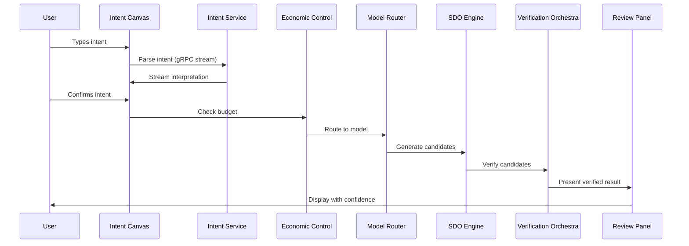

# AXIOM Platform Design Document

## Document Overview

This design document provides detailed technical specifications for implementing the AXIOM platform based on the comprehensive architecture v2.1.

**Version:** 2.1  
**Date:** January 25, 2026  
**Status:** Draft  

## Table of Contents

1. [System Architecture Design](#1-system-architecture-design)
2. [Component Design Specifications](#2-component-design-specifications)
3. [Data Architecture Design](#3-data-architecture-design)
4. [API Design](#4-api-design)
5. [Security Design](#5-security-design)
6. [Performance Design](#6-performance-design)
7. [Deployment Architecture](#7-deployment-architecture)
8. [Integration Design](#8-integration-design)
9. [Testing Strategy](#9-testing-strategy)
10. [Implementation Guidelines](#10-implementation-guidelines)

---

## 1. System Architecture Design

### 1.1 High-Level Architecture

The AXIOM platform follows a layered microservices architecture with event-driven communication.

```
┌─────────────────────────────────────────────────────────────────┐
│                    AXIOM PLATFORM                         │
├─────────────────────────────────────────────────────────────────┤
│  Frontend Layer (Next.js 14 + gRPC-Web)                        │
│  ├── Intent Canvas    ├── Review Panel    ├── Monitoring       │
│  └── Adaptive Scaffolding                 └── Team Dashboard   │
├─────────────────────────────────────────────────────────────────┤
│  AI Security Gateway (Input/Output Validation)                 │
├─────────────────────────────────────────────────────────────────┤
│  Semantic Control Plane (Go + gRPC)                           │
│  ├── Intent Service   ├── Economic Control ├── Speculation    │
│  ├── Learner Model    ├── Orchestration    └── Reasoning      │
├─────────────────────────────────────────────────────────────────┤
│  AI Layer (Python + FastAPI + gRPC)                           │
│  ├── Model Router     ├── SDO Engine       ├── Agent Pool     │
├─────────────────────────────────────────────────────────────────┤
│  Verification Layer (Rust + WASM + gRPC)                      │
│  ├── Tree-sitter      ├── WASM Sandbox     ├── SMT Portfolio  │
├─────────────────────────────────────────────────────────────────┤
│  Memory Layer (GraphRAG)                                      │
│  ├── pgvectorscale    ├── DGraph           ├── Unified Query  │
├─────────────────────────────────────────────────────────────────┤
│  Infrastructure Layer                                         │
│  ├── PostgreSQL 16    ├── Redis 7          ├── NATS JetStream │
│  └── Kubernetes       └── Observability    └── Security       │
└─────────────────────────────────────────────────────────────────┘
```

### 1.2 Service Communication Patterns

**Internal Communication:** gRPC with Protocol Buffers
**External API:** REST with OpenAPI 3.0
**Real-time Updates:** gRPC-Web streaming + WebSocket fallback
**Event Streaming:** NATS JetStream with event sourcing
**Caching:** Redis with semantic similarity caching

### 1.3 Request Flow Design



## 2. Component Design Specifications

### 2.1 Frontend Layer Design

#### 2.1.1 Intent Canvas Component

**Technology Stack:**
- React 18 with TypeScript 5
- Tree-sitter WASM for syntax highlighting
- gRPC-Web for streaming
- Zustand for state management

**Component Architecture:**
```typescript
interface IntentCanvasState {
  rawInput: string;
  parsedIntent: IntentSpec | null;
  interpretationConfidence: number;
  suggestedRefinements: Refinement[];
  activeConstraints: Constraint[];
  isConfirmed: boolean;
  astCache: TreeSitterAST | null;
  selectedModelConfig: ModelConfig | null;
}

interface IntentCanvasProps {
  projectId: string;
  onIntentConfirmed: (intent: IntentSpec) => void;
  onModelConfigChanged: (config: ModelConfig) => void;
}
```

**Key Features:**
- Real-time syntax highlighting with Tree-sitter (<10ms)
- Streaming intent interpretation via gRPC-Web
- Model selection dropdown with cost estimation
- Constraint tagging with autocomplete
- Side-by-side input/interpretation view

#### 2.1.2 Review Panel Component

**Component Architecture:**
```typescript
interface ReviewPanelState {
  ivcu: IVCU;
  viewLevel: 'Summary' | 'Detail' | 'Code';
  verificationExpanded: boolean;
  counterfactualActive: boolean;
  proofCertificate: ProofCertificate | null;
}

interface ReviewPanelProps {
  ivcu: IVCU;
  onAccept: () => void;
  onRefine: (refinement: string) => void;
  onExportWithProof: () => void;
}
```

**Key Features:**
- Tabbed view (Summary/Detail/Code)
- Expandable verification breakdown
- Proof certificate display with cryptographic validation
- Counterfactual explorer with "What if" scenarios
- Export functionality with proof bundle
### 2.2 Semantic Control Plane Design

#### 2.2.1 Intent Service

**Technology:** Go 1.22 with gRPC
**Database:** PostgreSQL 16 with event sourcing

**Service Interface:**
```protobuf
service IntentService {
  rpc ParseIntent(ParseRequest) returns (stream ParseEvent);
  rpc CreateIVCU(CreateRequest) returns (IVCU);
  rpc GetIVCU(GetRequest) returns (IVCU);
  rpc RefineIntent(RefineRequest) returns (stream RefineEvent);
  rpc GetHistory(HistoryRequest) returns (stream HistoryEvent);
}

message ParseRequest {
  string raw_intent = 1;
  string project_id = 2;
  repeated string context_hints = 3;
}

message ParseEvent {
  oneof event {
    InterpretationUpdate interpretation = 1;
    ConfidenceUpdate confidence = 2;
    RefinementSuggestion suggestion = 3;
    ParseComplete complete = 4;
  }
}
```

**Implementation Design:**
```go
type IntentService struct {
  db           *gorm.DB
  eventStore   EventStore
  nlpProcessor NLPProcessor
  validator    IntentValidator
}

func (s *IntentService) ParseIntent(req *ParseRequest, stream IntentService_ParseIntentServer) error {
  // 1. Validate input
  // 2. Extract context from project memory
  // 3. Stream incremental parsing results
  // 4. Generate formal contracts
  // 5. Validate consistency
  // 6. Store events
}
```

#### 2.2.2 Economic Control Plane

**Service Interface:**
```protobuf
service EconomicService {
  rpc EstimateCost(CostRequest) returns (CostEstimate);
  rpc CheckBudget(BudgetRequest) returns (BudgetStatus);
  rpc TrackUsage(UsageEvent) returns (UsageResponse);
  rpc GetSpendingReport(ReportRequest) returns (SpendingReport);
}

message CostRequest {
  string intent = 1;
  ModelConfig model_config = 2;
  VerificationConfig verification_config = 3;
}

message CostEstimate {
  double estimated_cost = 1;
  CostBreakdown breakdown = 2;
  repeated ModelOption alternatives = 3;
}
```

**Cost Calculation Logic:**
```go
type CostOracle struct {
  modelPricing map[string]ModelPricing
  verificationCosts VerificationCosts
}

func (c *CostOracle) EstimateCost(req *CostRequest) (*CostEstimate, error) {
  // 1. Estimate token count from intent
  // 2. Calculate model inference cost
  // 3. Add verification tier costs
  // 4. Apply bulk discounts
  // 5. Suggest cost-optimal alternatives
}
```
### 2.3 AI Layer Design

#### 2.3.1 Model Router

**Technology:** Python 3.12 with FastAPI and gRPC
**Key Features:** Multi-provider support, accuracy-first routing, auto-upgrade

**Service Interface:**
```python
from typing import Dict, List, Optional
from enum import Enum

class ModelTier(Enum):
    LOCAL = "local"
    BALANCED = "balanced"
    HIGH_ACCURACY = "high_accuracy"
    FRONTIER = "frontier"

class ModelRouter:
    def __init__(self):
        self.model_catalog = {
            ModelTier.LOCAL: [
                ModelConfig("qwen3-8b", cost_per_1k=0.0, accuracy=0.75),
                ModelConfig("gemma-3-4b", cost_per_1k=0.0, accuracy=0.70),
                ModelConfig("deepseek-coder-v2-7b", cost_per_1k=0.0, accuracy=0.80)
            ],
            ModelTier.BALANCED: [
                ModelConfig("deepseek-v3", cost_per_1k=0.002, accuracy=0.90),
                ModelConfig("claude-haiku", cost_per_1k=0.0025, accuracy=0.85),
                ModelConfig("gemini-2.0-flash", cost_per_1k=0.003, accuracy=0.88)
            ],
            ModelTier.HIGH_ACCURACY: [
                ModelConfig("claude-sonnet-4", cost_per_1k=0.015, accuracy=0.92),
                ModelConfig("gpt-4o", cost_per_1k=0.030, accuracy=0.91),
                ModelConfig("gemini-2.5-pro", cost_per_1k=0.035, accuracy=0.93)
            ],
            ModelTier.FRONTIER: [
                ModelConfig("claude-opus-4", cost_per_1k=0.150, accuracy=0.95)
            ]
        }
    
    async def route_request(self, 
                          request: GenerationRequest,
                          user_prefs: UserModelPreferences) -> ModelConfig:
        # 1. Check user overrides for task type
        # 2. Select default model (DeepSeek-V3 recommended)
        # 3. Validate budget constraints
        # 4. Return selected model configuration
        pass
    
    async def handle_verification_failure(self,
                                        original_model: ModelConfig,
                                        failure_count: int,
                                        user_prefs: UserModelPreferences) -> Optional[ModelConfig]:
        # Auto-upgrade logic when verification fails
        if failure_count >= 2 and user_prefs.auto_upgrade_enabled:
            return self._upgrade_to_next_tier(original_model)
        return None
```

#### 2.3.2 SDO Engine (Speculative Decoding Optimization)

**Algorithm Implementation:**
```python
class SDOEngine:
    def __init__(self):
        self.draft_model = "qwen3-8b"  # Fast 7B model for initial generation
        self.primary_models = {}  # Tier-specific models
        self.bandit = ThompsonSamplingBandit()
    
    async def generate_candidates(self, 
                                intent: IntentSpec,
                                model_config: ModelConfig,
                                max_candidates: int = 5) -> List[Candidate]:
        strategy = self.bandit.select_strategy()
        
        if strategy == "pruned_tree":
            return await self._pruned_candidate_tree(intent, model_config)
        elif strategy == "parallel":
            return await self._parallel_generation(intent, model_config, max_candidates)
        else:  # sequential
            return await self._sequential_generation(intent, model_config, max_candidates)
    
    async def _pruned_candidate_tree(self, 
                                   intent: IntentSpec,
                                   model_config: ModelConfig) -> List[Candidate]:
        # 1. Generate initial tokens with draft model (depth: 50, branches: 5)
        initial_branches = await self._generate_initial_branches(intent, depth=50, branches=5)
        
        # 2. Prune tree based on confidence scoring (threshold: 0.3, retain: top 2)
        surviving_branches = self._prune_branches(initial_branches, threshold=0.3, retain=2)
        
        # 3. Extend surviving branches with primary model + inline Tier 1 verification
        candidates = []
        for branch in surviving_branches:
            candidate = await self._extend_branch(branch, model_config)
            if await self._tier1_verification(candidate):
                candidates.append(candidate)
                if candidate.confidence > 0.9:  # Early stop for high confidence
                    break
        
        return candidates
```
### 2.4 Verification Layer Design

#### 2.4.1 Verification Orchestra

**Technology:** Rust with Wasmtime, gRPC, and SMT solvers
**Architecture:** Multi-tier parallel verification with confidence aggregation

**Service Interface:**
```rust
use tonic::{Request, Response, Status};
use tokio_stream::Stream;

#[tonic::async_trait]
impl VerificationService for VerificationOrchestra {
    type VerifyStream = Pin<Box<dyn Stream<Item = Result<VerificationEvent, Status>> + Send>>;
    
    async fn verify(
        &self,
        request: Request<VerifyRequest>,
    ) -> Result<Response<Self::VerifyStream>, Status> {
        let req = request.into_inner();
        let (tx, rx) = mpsc::channel(100);
        
        tokio::spawn(async move {
            self.run_verification_pipeline(req, tx).await;
        });
        
        Ok(Response::new(Box::pin(ReceiverStream::new(rx))))
    }
}

impl VerificationOrchestra {
    async fn run_verification_pipeline(
        &self,
        request: VerifyRequest,
        tx: mpsc::Sender<Result<VerificationEvent, Status>>,
    ) {
        // Tier 0: Tree-sitter parsing (<10ms)
        let tier0_result = self.tree_sitter_verifier.verify(&request.code).await;
        self.send_event(&tx, VerificationEvent::Tier0Complete(tier0_result)).await;
        
        if !tier0_result.passed {
            return; // Early exit on syntax errors
        }
        
        // Tier 1: Type checking and linting (<2s)
        let tier1_futures = vec![
            self.type_checker.verify(&request.code),
            self.linter.verify(&request.code),
        ];
        
        let tier1_results = futures::future::join_all(tier1_futures).await;
        let tier1_confidence = self.aggregate_confidence(&tier1_results);
        
        // Tier 2: Dynamic testing (2-15s)
        if tier1_confidence > 0.7 {
            let wasm_result = self.wasm_sandbox.execute_tests(&request.code).await;
            self.send_event(&tx, VerificationEvent::Tier2Complete(wasm_result)).await;
        }
        
        // Tier 3: Formal verification (15s-5min)
        if request.verification_config.enable_formal && tier1_confidence > 0.8 {
            let smt_results = self.smt_portfolio.verify(&request.code).await;
            self.send_event(&tx, VerificationEvent::Tier3Complete(smt_results)).await;
        }
    }
}
```

#### 2.4.2 WASM Sandbox Design

**Sandbox Configuration:**
```rust
pub struct WasmSandbox {
    engine: wasmtime::Engine,
    config: SandboxConfig,
}

pub struct SandboxConfig {
    pub max_memory: u64,        // 64MB default
    pub max_fuel: u64,          // CPU limiting
    pub timeout: Duration,      // 30s default
    pub allowed_imports: Vec<String>,
}

impl WasmSandbox {
    pub async fn execute_code(&self, code: &str, language: Language) -> SandboxResult {
        // 1. Compile code to WASM
        let wasm_bytes = self.compile_to_wasm(code, language).await?;
        
        // 2. Create isolated store with fuel limiting
        let mut store = Store::new(&self.engine, ());
        store.set_fuel(self.config.max_fuel)?;
        
        // 3. Instantiate module with limited imports
        let module = Module::new(&self.engine, &wasm_bytes)?;
        let instance = Instance::new(&mut store, &module, &[])?;
        
        // 4. Execute with timeout
        let result = tokio::time::timeout(
            self.config.timeout,
            self.run_with_fuel_check(&mut store, &instance)
        ).await;
        
        // 5. Capture output and cleanup
        match result {
            Ok(output) => SandboxResult::Success(output),
            Err(_) => SandboxResult::Timeout,
        }
    }
}
```
#### 2.4.3 SMT Solver Portfolio

**Multi-Solver Architecture:**
```rust
pub struct SMTPortfolio {
    solvers: Vec<Box<dyn SMTSolver>>,
    timeout_per_solver: Duration,
}

#[async_trait]
pub trait SMTSolver: Send + Sync {
    async fn solve(&self, constraints: &[Constraint]) -> SMTResult;
    fn specialization(&self) -> SolverSpecialization;
}

pub struct Z3Solver;
pub struct CVC5Solver;
pub struct BitwuzlaSolver;

impl SMTPortfolio {
    pub async fn verify_constraints(&self, constraints: &[Constraint]) -> PortfolioResult {
        // Run solvers in parallel (race mode)
        let solver_futures: Vec<_> = self.solvers.iter()
            .map(|solver| {
                let constraints = constraints.to_vec();
                async move {
                    tokio::time::timeout(
                        self.timeout_per_solver,
                        solver.solve(&constraints)
                    ).await
                }
            })
            .collect();
        
        let results = futures::future::join_all(solver_futures).await;
        
        // Aggregate results with consensus scoring
        let unsat_core = self.compute_unsat_core(&results);
        let confidence = self.compute_consensus_confidence(&results);
        
        PortfolioResult {
            unsat_core,
            confidence,
            solver_results: results,
        }
    }
    
    fn compute_consensus_confidence(&self, results: &[SMTResult]) -> f64 {
        let agreement_count = self.count_solver_agreement(results);
        let base_confidence = self.base_confidence_from_results(results);
        
        base_confidence + (agreement_count as f64 * 0.2).min(0.3)
    }
}
```

### 2.5 Memory Layer Design (GraphRAG)

#### 2.5.1 Unified Memory Architecture

**Technology Stack:**
- pgvectorscale (PostgreSQL extension) for vector operations
- DGraph for graph relationships
- Unified query layer for combined semantic + structural search

**Memory Service Interface:**
```python
from typing import List, Dict, Optional
import asyncio
import asyncpg
import pydgraph

class GraphRAGMemory:
    def __init__(self):
        self.pg_pool = None  # PostgreSQL connection pool
        self.dgraph_client = None  # DGraph client
        self.embedding_model = "text-embedding-3-small"
    
    async def store_memory_node(self, 
                              content: str,
                              node_type: MemoryNodeType,
                              relationships: List[Relationship],
                              project_id: str) -> str:
        # 1. Generate embedding
        embedding = await self.generate_embedding(content)
        
        # 2. Store in PostgreSQL with pgvectorscale
        node_id = await self.store_vector_node(content, embedding, node_type, project_id)
        
        # 3. Store relationships in DGraph
        await self.store_graph_relationships(node_id, relationships)
        
        return node_id
    
    async def unified_search(self,
                           query: str,
                           project_id: str,
                           similarity_threshold: float = 0.8,
                           max_depth: int = 3) -> List[MemoryNode]:
        # 1. Semantic search with pgvectorscale
        query_embedding = await self.generate_embedding(query)
        
        similar_nodes = await self.pg_pool.fetch("""
            SELECT id, content, embedding <=> $1 as distance
            FROM memory_nodes 
            WHERE project_id = $2 
            AND embedding <=> $1 < $3
            ORDER BY distance
            LIMIT 20
        """, query_embedding, project_id, 1.0 - similarity_threshold)
        
        # 2. Expand with graph relationships via DGraph
        expanded_nodes = []
        for node in similar_nodes:
            related = await self.get_related_nodes(node['id'], max_depth)
            expanded_nodes.extend(related)
        
        return self.deduplicate_and_rank(expanded_nodes)
```
#### 2.5.2 pgvectorscale Configuration

**Database Schema:**
```sql
-- Enable pgvectorscale extension
CREATE EXTENSION IF NOT EXISTS vectorscale CASCADE;

-- Memory nodes table with vector support
CREATE TABLE memory_nodes (
    id UUID PRIMARY KEY DEFAULT gen_random_uuid(),
    project_id UUID NOT NULL REFERENCES projects(id),
    content TEXT NOT NULL,
    node_type memory_node_type NOT NULL,
    embedding vector(1536) NOT NULL,  -- OpenAI embedding dimension
    metadata JSONB DEFAULT '{}',
    created_at TIMESTAMP WITH TIME ZONE DEFAULT NOW(),
    updated_at TIMESTAMP WITH TIME ZONE DEFAULT NOW()
);

-- Create DiskANN index for high-performance similarity search
CREATE INDEX ON memory_nodes 
USING diskann (embedding vector_cosine_ops)
WITH (
    num_bits_per_dimension = 1,  -- Binary quantization
    search_list_size = 100,      -- High recall
    max_alpha = 1.2
);

-- Partial index for project-scoped searches
CREATE INDEX memory_nodes_project_embedding_idx 
ON memory_nodes USING diskann (embedding vector_cosine_ops)
WHERE project_id IS NOT NULL;
```

**Query Optimization:**
```python
class VectorSearchOptimizer:
    async def optimized_similarity_search(self,
                                        query_embedding: List[float],
                                        project_id: str,
                                        limit: int = 20) -> List[Dict]:
        # Use binary quantization for 32x compression and speed
        query = """
            SELECT 
                id, 
                content, 
                node_type,
                embedding <=> $1::vector as distance,
                metadata
            FROM memory_nodes 
            WHERE project_id = $2
            AND embedding <=> $1::vector < 0.2  -- Pre-filter for efficiency
            ORDER BY embedding <=> $1::vector
            LIMIT $3
        """
        
        return await self.pg_pool.fetch(query, query_embedding, project_id, limit)
```

#### 2.5.3 DGraph Integration

**Schema Definition:**
```graphql
type MemoryNode {
    id: ID!
    content: String!
    nodeType: String!
    projectId: String!
    createdAt: DateTime!
    
    # Relationships
    dependsOn: [MemoryNode] @reverse(predicate: dependencies)
    implements: [MemoryNode] @reverse(predicate: implementations)
    relatedTo: [MemoryNode] @reverse(predicate: relations)
}

type Project {
    id: ID!
    name: String!
    memoryNodes: [MemoryNode] @reverse(predicate: projectId)
}
```

**Graph Query Examples:**
```python
async def find_dependencies_with_context(self, node_id: str, max_depth: int = 3) -> List[Dict]:
    query = f"""
    {{
        node(func: eq(id, "{node_id}")) {{
            id
            content
            nodeType
            dependsOn @recurse(depth: {max_depth}) {{
                id
                content
                nodeType
                implements {{
                    id
                    content
                }}
            }}
        }}
    }}
    """
    
    response = await self.dgraph_client.query(query)
    return response.json
```
## 3. Data Architecture Design

### 3.1 Event Sourcing Design

**Event Store Schema:**
```sql
-- Event store for complete audit trail
CREATE TABLE ivcu_events (
    id UUID PRIMARY KEY DEFAULT gen_random_uuid(),
    ivcu_id UUID NOT NULL,
    sequence_number BIGINT NOT NULL,
    event_type VARCHAR(100) NOT NULL,
    event_data JSONB NOT NULL,
    timestamp TIMESTAMP WITH TIME ZONE DEFAULT NOW(),
    actor_id UUID REFERENCES users(id),
    correlation_id UUID,
    
    UNIQUE(ivcu_id, sequence_number)
);

-- Index for efficient event replay
CREATE INDEX ivcu_events_replay_idx ON ivcu_events (ivcu_id, sequence_number);
CREATE INDEX ivcu_events_type_idx ON ivcu_events (event_type, timestamp);

-- Current state projection (for fast reads)
CREATE TABLE ivcu_projections (
    ivcu_id UUID PRIMARY KEY,
    current_state JSONB NOT NULL,
    last_event_sequence BIGINT NOT NULL,
    updated_at TIMESTAMP WITH TIME ZONE DEFAULT NOW()
);
```

**Event Types and Schemas:**
```go
type EventType string

const (
    IntentCreated        EventType = "intent.created"
    IntentRefined        EventType = "intent.refined"
    ContractAdded        EventType = "contract.added"
    CandidateGenerated   EventType = "candidate.generated"
    VerificationCompleted EventType = "verification.completed"
    CandidateSelected    EventType = "candidate.selected"
    ProofGenerated       EventType = "proof.generated"
    IVCUDeployed        EventType = "ivcu.deployed"
)

type IntentCreatedEvent struct {
    RawIntent    string    `json:"raw_intent"`
    ParsedIntent IntentSpec `json:"parsed_intent"`
    UserID       string    `json:"user_id"`
    ProjectID    string    `json:"project_id"`
}

type VerificationCompletedEvent struct {
    CandidateID string            `json:"candidate_id"`
    Tier        int              `json:"tier"`
    Results     VerificationResult `json:"results"`
    Confidence  float64          `json:"confidence"`
    Duration    time.Duration    `json:"duration"`
}
```

**Event Sourcing Service:**
```go
type EventStore interface {
    AppendEvent(ctx context.Context, event Event) error
    GetEvents(ctx context.Context, aggregateID string, fromSequence int64) ([]Event, error)
    GetSnapshot(ctx context.Context, aggregateID string) (*Snapshot, error)
    SaveSnapshot(ctx context.Context, snapshot Snapshot) error
}

type IVCUAggregate struct {
    ID       string
    Version  int64
    State    IVCUState
    Events   []Event
}

func (a *IVCUAggregate) ApplyEvent(event Event) error {
    switch e := event.Data.(type) {
    case IntentCreatedEvent:
        a.State.RawIntent = e.RawIntent
        a.State.ParsedIntent = e.ParsedIntent
        a.State.Status = StatusDraft
    case CandidateSelectedEvent:
        a.State.SelectedCandidate = e.Candidate
        a.State.Status = StatusVerified
    // ... other event handlers
    }
    a.Version = event.Sequence
    return nil
}
```

### 3.2 Database Design

#### 3.2.1 Core Tables

**Projects and Users:**
```sql
CREATE TABLE organizations (
    id UUID PRIMARY KEY DEFAULT gen_random_uuid(),
    name VARCHAR(255) NOT NULL,
    settings JSONB DEFAULT '{}',
    created_at TIMESTAMP WITH TIME ZONE DEFAULT NOW()
);

CREATE TABLE users (
    id UUID PRIMARY KEY DEFAULT gen_random_uuid(),
    email VARCHAR(255) UNIQUE NOT NULL,
    name VARCHAR(255) NOT NULL,
    org_id UUID REFERENCES organizations(id),
    role user_role NOT NULL DEFAULT 'developer',
    trust_dial_default INTEGER DEFAULT 5 CHECK (trust_dial_default BETWEEN 1 AND 10),
    preferences JSONB DEFAULT '{}',
    created_at TIMESTAMP WITH TIME ZONE DEFAULT NOW()
);

CREATE TABLE projects (
    id UUID PRIMARY KEY DEFAULT gen_random_uuid(),
    name VARCHAR(255) NOT NULL,
    owner_id UUID NOT NULL REFERENCES users(id),
    org_id UUID REFERENCES organizations(id),
    security_context security_context_type DEFAULT 'public',
    settings JSONB DEFAULT '{}',
    created_at TIMESTAMP WITH TIME ZONE DEFAULT NOW(),
    updated_at TIMESTAMP WITH TIME ZONE DEFAULT NOW()
);
```

**IVCU Core Table:**
```sql
CREATE TABLE ivcus (
    id UUID PRIMARY KEY DEFAULT gen_random_uuid(),
    project_id UUID NOT NULL REFERENCES projects(id),
    version INTEGER NOT NULL DEFAULT 1,
    
    -- Intent
    raw_intent TEXT NOT NULL,
    parsed_intent JSONB NOT NULL,
    
    -- Contracts
    contracts JSONB DEFAULT '[]',
    
    -- Implementation
    code TEXT,
    language VARCHAR(50),
    
    -- Verification
    verification_result JSONB,
    confidence_score DECIMAL(3,2) CHECK (confidence_score BETWEEN 0 AND 1),
    
    -- Proof Certificate
    proof_certificate_id UUID REFERENCES proof_certificates(id),
    
    -- Provenance
    model_id VARCHAR(100),
    model_version VARCHAR(50),
    generation_params JSONB DEFAULT '{}',
    input_hash VARCHAR(64),
    output_hash VARCHAR(64),
    
    -- Metadata
    status ivcu_status DEFAULT 'draft',
    created_at TIMESTAMP WITH TIME ZONE DEFAULT NOW(),
    created_by UUID NOT NULL REFERENCES users(id),
    parent_ids UUID[] DEFAULT '{}',
    
    -- Event sourcing reference
    event_sequence BIGINT NOT NULL DEFAULT 0,
    
    UNIQUE(project_id, version)
);
```
#### 3.2.2 Proof Certificates Table

```sql
CREATE TABLE proof_certificates (
    id UUID PRIMARY KEY DEFAULT gen_random_uuid(),
    ivcu_id UUID NOT NULL REFERENCES ivcus(id),
    proof_type proof_type_enum NOT NULL,
    assertions JSONB NOT NULL,
    proof_data BYTEA NOT NULL,
    verifier_version VARCHAR(50) NOT NULL,
    hash_chain VARCHAR(128) NOT NULL,
    signature BYTEA NOT NULL,
    created_at TIMESTAMP WITH TIME ZONE DEFAULT NOW(),
    
    -- Ensure one proof per IVCU per type
    UNIQUE(ivcu_id, proof_type)
);

-- Index for proof verification queries
CREATE INDEX proof_certificates_hash_idx ON proof_certificates (hash_chain);
CREATE INDEX proof_certificates_type_idx ON proof_certificates (proof_type, created_at);
```

#### 3.2.3 Budget and Cost Tracking

```sql
CREATE TABLE budgets (
    id UUID PRIMARY KEY DEFAULT gen_random_uuid(),
    owner_type owner_type_enum NOT NULL,  -- 'user', 'project', 'organization'
    owner_id UUID NOT NULL,
    limit_amount DECIMAL(10,4) NOT NULL,
    used_amount DECIMAL(10,4) DEFAULT 0,
    period budget_period_enum DEFAULT 'monthly',
    reset_at TIMESTAMP WITH TIME ZONE,
    created_at TIMESTAMP WITH TIME ZONE DEFAULT NOW(),
    
    UNIQUE(owner_type, owner_id, period)
);

CREATE TABLE generation_logs (
    id UUID PRIMARY KEY DEFAULT gen_random_uuid(),
    ivcu_id UUID REFERENCES ivcus(id),
    model_id VARCHAR(100) NOT NULL,
    model_tier model_tier_enum NOT NULL,
    tokens_in INTEGER NOT NULL,
    tokens_out INTEGER NOT NULL,
    latency_ms INTEGER NOT NULL,
    cost DECIMAL(8,6) NOT NULL,
    timestamp TIMESTAMP WITH TIME ZONE DEFAULT NOW()
);

-- Indexes for cost analysis
CREATE INDEX generation_logs_cost_analysis_idx ON generation_logs (model_tier, timestamp);
CREATE INDEX generation_logs_user_cost_idx ON generation_logs (ivcu_id, timestamp);
```

### 3.3 Caching Strategy

#### 3.3.1 Redis Cache Design

**Cache Layers:**
```python
class CacheManager:
    def __init__(self):
        self.redis = redis.Redis(decode_responses=True)
        self.semantic_cache = SemanticCache()
        
    # L1: Request-response cache (TTL: 1 hour)
    async def cache_generation_result(self, intent_hash: str, result: GenerationResult):
        key = f"generation:{intent_hash}"
        await self.redis.setex(key, 3600, json.dumps(result.dict()))
    
    # L2: Semantic similarity cache (TTL: 24 hours)
    async def cache_semantic_result(self, intent_embedding: List[float], result: GenerationResult):
        await self.semantic_cache.store(intent_embedding, result, ttl=86400)
    
    # L3: Model inference cache (TTL: 7 days)
    async def cache_model_output(self, model_id: str, prompt_hash: str, output: str):
        key = f"model:{model_id}:{prompt_hash}"
        await self.redis.setex(key, 604800, output)
```

**Semantic Cache Implementation:**
```python
class SemanticCache:
    def __init__(self, similarity_threshold: float = 0.92):
        self.threshold = similarity_threshold
        self.max_size = 1000
        
    async def get(self, query_embedding: List[float]) -> Optional[CacheEntry]:
        # 1. Compute similarity with all cached embeddings
        similarities = await self.compute_similarities(query_embedding)
        
        # 2. Find best match above threshold
        best_match = max(similarities, key=lambda x: x.similarity)
        
        if best_match.similarity >= self.threshold:
            # 3. Update LRU order
            await self.update_lru(best_match.key)
            return best_match.entry
        
        return None
    
    async def store(self, embedding: List[float], result: GenerationResult, ttl: int):
        # 1. Check if cache is full
        if await self.size() >= self.max_size:
            await self.evict_lru()
        
        # 2. Store with metadata
        entry = CacheEntry(
            embedding=embedding,
            result=result,
            created_at=datetime.utcnow(),
            access_count=1
        )
        
        await self.redis.setex(f"semantic:{hash(str(embedding))}", ttl, entry.json())
```
## 4. API Design

### 4.1 gRPC Service Definitions

#### 4.1.1 Generation Service

```protobuf
syntax = "proto3";

package axiom.generation.v1;

service GenerationService {
  // Bidirectional streaming for real-time generation
  rpc GenerateStream(stream GenerationRequest) returns (stream GenerationEvent);
  
  // Server streaming for verification progress
  rpc VerifyStream(VerifyRequest) returns (stream VerificationEvent);
  
  // Unary RPCs for simple operations
  rpc GetGeneration(GetGenerationRequest) returns (Generation);
  rpc CancelGeneration(CancelGenerationRequest) returns (CancelGenerationResponse);
}

message GenerationRequest {
  string intent = 1;
  string project_id = 2;
  ModelConfig model_config = 3;
  VerificationConfig verification_config = 4;
  repeated string context_hints = 5;
}

message GenerationEvent {
  string generation_id = 1;
  oneof event {
    IntentParsed intent_parsed = 2;
    CandidateGenerated candidate_generated = 3;
    CandidatePruned candidate_pruned = 4;
    VerificationStarted verification_started = 5;
    VerificationCompleted verification_completed = 6;
    ProofGenerated proof_generated = 7;
    GenerationCompleted generation_completed = 8;
    GenerationFailed generation_failed = 9;
    CostUpdate cost_update = 10;
  }
}

message ModelConfig {
  string model_id = 1;
  ModelTier tier = 2;
  map<string, string> parameters = 3;
  bool auto_upgrade_enabled = 4;
}

enum ModelTier {
  MODEL_TIER_UNSPECIFIED = 0;
  MODEL_TIER_LOCAL = 1;
  MODEL_TIER_BALANCED = 2;
  MODEL_TIER_HIGH_ACCURACY = 3;
  MODEL_TIER_FRONTIER = 4;
}
```

#### 4.1.2 Memory Service

```protobuf
service MemoryService {
  rpc StoreNode(StoreNodeRequest) returns (StoreNodeResponse);
  rpc SemanticSearch(SearchRequest) returns (stream MemoryNode);
  rpc GraphTraversal(TraversalRequest) returns (stream MemoryNode);
  rpc UnifiedSearch(UnifiedSearchRequest) returns (stream SearchResult);
  rpc ImpactAnalysis(ImpactRequest) returns (ImpactGraph);
}

message StoreNodeRequest {
  string content = 1;
  MemoryNodeType node_type = 2;
  string project_id = 3;
  repeated Relationship relationships = 4;
  map<string, string> metadata = 5;
}

message UnifiedSearchRequest {
  string query = 1;
  string project_id = 2;
  float similarity_threshold = 3;
  int32 max_depth = 4;
  SearchMode mode = 5;
}

enum SearchMode {
  SEARCH_MODE_UNSPECIFIED = 0;
  SEARCH_MODE_SEMANTIC_ONLY = 1;
  SEARCH_MODE_GRAPH_ONLY = 2;
  SEARCH_MODE_UNIFIED = 3;
}

message SearchResult {
  MemoryNode node = 1;
  float similarity_score = 2;
  int32 graph_distance = 3;
  repeated string relationship_path = 4;
}
```

### 4.2 REST API Design

#### 4.2.1 OpenAPI Specification Structure

```yaml
openapi: 3.0.3
info:
  title: AXIOM Platform API
  version: 2.1.0
  description: Intent-driven development platform API

servers:
  - url: https://api.axiom.dev/v1
    description: Production server
  - url: https://staging-api.axiom.dev/v1
    description: Staging server

security:
  - BearerAuth: []

paths:
  /intent:
    post:
      summary: Create IVCU from intent
      operationId: createIVCU
      requestBody:
        required: true
        content:
          application/json:
            schema:
              $ref: '#/components/schemas/CreateIVCURequest'
      responses:
        '201':
          description: IVCU created successfully
          content:
            application/json:
              schema:
                $ref: '#/components/schemas/IVCU'
        '400':
          $ref: '#/components/responses/BadRequest'
        '429':
          $ref: '#/components/responses/RateLimited'

  /intent/{id}:
    get:
      summary: Get IVCU by ID
      parameters:
        - name: id
          in: path
          required: true
          schema:
            type: string
            format: uuid
      responses:
        '200':
          description: IVCU retrieved successfully
          content:
            application/json:
              schema:
                $ref: '#/components/schemas/IVCU'
```

#### 4.2.2 Request/Response Schemas

```yaml
components:
  schemas:
    IVCU:
      type: object
      required:
        - id
        - project_id
        - raw_intent
        - status
        - created_at
      properties:
        id:
          type: string
          format: uuid
        project_id:
          type: string
          format: uuid
        version:
          type: integer
          minimum: 1
        raw_intent:
          type: string
          maxLength: 10000
        parsed_intent:
          $ref: '#/components/schemas/IntentSpec'
        contracts:
          type: array
          items:
            $ref: '#/components/schemas/Contract'
        code:
          type: string
        language:
          type: string
          enum: [python, javascript, typescript, go, rust, java]
        verification_result:
          $ref: '#/components/schemas/VerificationResult'
        confidence_score:
          type: number
          minimum: 0
          maximum: 1
        proof_certificate:
          $ref: '#/components/schemas/ProofCertificate'
        status:
          $ref: '#/components/schemas/IVCUStatus'
        created_at:
          type: string
          format: date-time

    IntentSpec:
      type: object
      properties:
        summary:
          type: string
        constraints:
          type: array
          items:
            $ref: '#/components/schemas/Constraint'
        context:
          type: object
        confidence:
          type: number
          minimum: 0
          maximum: 1

    VerificationResult:
      type: object
      properties:
        overall_confidence:
          type: number
          minimum: 0
          maximum: 1
        tier_results:
          type: array
          items:
            $ref: '#/components/schemas/TierResult'
        proof_certificate_id:
          type: string
          format: uuid

    ProofCertificate:
      type: object
      properties:
        id:
          type: string
          format: uuid
        proof_type:
          type: string
          enum: [type_safety, memory_safety, contract_compliance, property_based]
        assertions:
          type: array
          items:
            $ref: '#/components/schemas/FormalAssertion'
        hash_chain:
          type: string
        signature:
          type: string
        created_at:
          type: string
          format: date-time
```
### 4.3 WebSocket API Design

#### 4.3.1 Real-time Event Streaming

```typescript
// WebSocket event types
interface WebSocketEvent {
  type: string;
  timestamp: string;
  data: any;
}

interface GenerationProgressEvent extends WebSocketEvent {
  type: 'generation.progress';
  data: {
    generation_id: string;
    ivcu_id: string;
    stage: 'parsing' | 'generating' | 'verifying' | 'completing';
    progress: number; // 0-100
    tokens?: string[];
    confidence?: number;
  };
}

interface VerificationProgressEvent extends WebSocketEvent {
  type: 'verification.progress';
  data: {
    verification_id: string;
    tier: number;
    verifier: string;
    status: 'running' | 'completed' | 'failed';
    result?: VerificationResult;
  };
}

interface TeamActivityEvent extends WebSocketEvent {
  type: 'team.activity';
  data: {
    user_id: string;
    user_name: string;
    action: 'created_ivcu' | 'refined_intent' | 'accepted_result';
    ivcu_id: string;
    project_id: string;
  };
}
```

#### 4.3.2 WebSocket Client Implementation

```typescript
class AxiomWebSocketClient {
  private ws: WebSocket | null = null;
  private eventHandlers: Map<string, Function[]> = new Map();
  private reconnectAttempts = 0;
  private maxReconnectAttempts = 5;

  constructor(private baseUrl: string, private authToken: string) {}

  connect(): Promise<void> {
    return new Promise((resolve, reject) => {
      const wsUrl = `${this.baseUrl}/ws/v1?token=${this.authToken}`;
      this.ws = new WebSocket(wsUrl);

      this.ws.onopen = () => {
        console.log('WebSocket connected');
        this.reconnectAttempts = 0;
        resolve();
      };

      this.ws.onmessage = (event) => {
        try {
          const wsEvent: WebSocketEvent = JSON.parse(event.data);
          this.handleEvent(wsEvent);
        } catch (error) {
          console.error('Failed to parse WebSocket message:', error);
        }
      };

      this.ws.onclose = () => {
        console.log('WebSocket disconnected');
        this.attemptReconnect();
      };

      this.ws.onerror = (error) => {
        console.error('WebSocket error:', error);
        reject(error);
      };
    });
  }

  subscribe(eventType: string, handler: Function): void {
    if (!this.eventHandlers.has(eventType)) {
      this.eventHandlers.set(eventType, []);
    }
    this.eventHandlers.get(eventType)!.push(handler);
  }

  private handleEvent(event: WebSocketEvent): void {
    const handlers = this.eventHandlers.get(event.type) || [];
    handlers.forEach(handler => handler(event));
  }

  private attemptReconnect(): void {
    if (this.reconnectAttempts < this.maxReconnectAttempts) {
      this.reconnectAttempts++;
      const delay = Math.pow(2, this.reconnectAttempts) * 1000; // Exponential backoff
      
      setTimeout(() => {
        console.log(`Attempting to reconnect (${this.reconnectAttempts}/${this.maxReconnectAttempts})`);
        this.connect().catch(() => this.attemptReconnect());
      }, delay);
    }
  }
}
```

## 5. Security Design

### 5.1 Authentication and Authorization

#### 5.1.1 JWT Token Structure

```typescript
interface AxiomJWTPayload {
  sub: string;           // User ID
  email: string;         // User email
  name: string;          // User display name
  org_id: string;        // Organization ID
  role: UserRole;        // User role
  permissions: string[]; // Specific permissions
  projects: string[];    // Accessible project IDs
  security_context: SecurityContext;
  exp: number;          // Expiration timestamp
  iat: number;          // Issued at timestamp
  jti: string;          // JWT ID for revocation
}

enum UserRole {
  VIEWER = 'viewer',
  DEVELOPER = 'developer',
  ADMIN = 'admin',
  OWNER = 'owner'
}

enum SecurityContext {
  PUBLIC = 'public',
  CONFIDENTIAL = 'confidential',
  REGULATED = 'regulated',
  SOVEREIGN = 'sovereign'
}
```

#### 5.1.2 RBAC Implementation

```go
type Permission string

const (
    PermissionReadProject     Permission = "project:read"
    PermissionWriteProject    Permission = "project:write"
    PermissionDeleteProject   Permission = "project:delete"
    PermissionCreateIVCU      Permission = "ivcu:create"
    PermissionReadIVCU        Permission = "ivcu:read"
    PermissionUpdateIVCU      Permission = "ivcu:update"
    PermissionDeleteIVCU      Permission = "ivcu:delete"
    PermissionManageTeam      Permission = "team:manage"
    PermissionViewAuditLog    Permission = "audit:read"
    PermissionExportProof     Permission = "proof:export"
)

type RolePermissions map[UserRole][]Permission

var DefaultRolePermissions = RolePermissions{
    RoleViewer: {
        PermissionReadProject,
        PermissionReadIVCU,
    },
    RoleDeveloper: {
        PermissionReadProject,
        PermissionWriteProject,
        PermissionCreateIVCU,
        PermissionReadIVCU,
        PermissionUpdateIVCU,
        PermissionExportProof,
    },
    RoleAdmin: {
        PermissionReadProject,
        PermissionWriteProject,
        PermissionDeleteProject,
        PermissionCreateIVCU,
        PermissionReadIVCU,
        PermissionUpdateIVCU,
        PermissionDeleteIVCU,
        PermissionManageTeam,
        PermissionViewAuditLog,
        PermissionExportProof,
    },
    RoleOwner: {
        // All permissions
    },
}

type AuthorizationService struct {
    rolePermissions RolePermissions
}

func (a *AuthorizationService) HasPermission(user *User, permission Permission, resourceID string) bool {
    // 1. Check role-based permissions
    rolePerms := a.rolePermissions[user.Role]
    if !contains(rolePerms, permission) {
        return false
    }
    
    // 2. Check resource-level access
    return a.hasResourceAccess(user, resourceID)
}
```
### 5.2 AI Security Gateway

#### 5.2.1 Input Sanitization

```python
import re
from typing import List, Dict, Optional
from dataclasses import dataclass

@dataclass
class SecurityThreat:
    type: str
    severity: str  # 'low', 'medium', 'high', 'critical'
    description: str
    location: Optional[str] = None

class InputSanitizer:
    def __init__(self):
        # Prompt injection patterns
        self.injection_patterns = [
            r'ignore\s+previous\s+instructions',
            r'system\s*:\s*you\s+are',
            r'<\s*system\s*>',
            r'jailbreak',
            r'pretend\s+you\s+are',
            r'act\s+as\s+if',
            r'forget\s+everything',
            r'new\s+instructions',
        ]
        
        # Sensitive data patterns
        self.sensitive_patterns = {
            'api_key': r'[a-zA-Z0-9]{32,}',
            'password': r'password\s*[:=]\s*[^\s]+',
            'email': r'\b[A-Za-z0-9._%+-]+@[A-Za-z0-9.-]+\.[A-Z|a-z]{2,}\b',
            'credit_card': r'\b\d{4}[-\s]?\d{4}[-\s]?\d{4}[-\s]?\d{4}\b',
        }
    
    def sanitize_input(self, user_input: str, context: Dict) -> tuple[str, List[SecurityThreat]]:
        threats = []
        sanitized_input = user_input
        
        # 1. Check for prompt injection
        for pattern in self.injection_patterns:
            if re.search(pattern, user_input, re.IGNORECASE):
                threats.append(SecurityThreat(
                    type='prompt_injection',
                    severity='high',
                    description=f'Potential prompt injection detected: {pattern}'
                ))
        
        # 2. Check for sensitive data
        for data_type, pattern in self.sensitive_patterns.items():
            matches = re.findall(pattern, user_input, re.IGNORECASE)
            if matches:
                threats.append(SecurityThreat(
                    type='sensitive_data',
                    severity='medium',
                    description=f'Potential {data_type} detected'
                ))
                # Redact sensitive data
                sanitized_input = re.sub(pattern, '[REDACTED]', sanitized_input, flags=re.IGNORECASE)
        
        # 3. Length validation
        if len(user_input) > 10000:  # 10KB limit
            threats.append(SecurityThreat(
                type='input_size',
                severity='low',
                description='Input exceeds maximum length'
            ))
            sanitized_input = sanitized_input[:10000]
        
        return sanitized_input, threats

class OutputValidator:
    def __init__(self):
        self.credential_patterns = [
            r'sk-[a-zA-Z0-9]{48}',  # OpenAI API keys
            r'AIza[0-9A-Za-z\\-_]{35}',  # Google API keys
            r'AKIA[0-9A-Z]{16}',  # AWS access keys
        ]
        
        self.pii_patterns = [
            r'\b\d{3}-\d{2}-\d{4}\b',  # SSN
            r'\b\d{4}[-\s]?\d{4}[-\s]?\d{4}[-\s]?\d{4}\b',  # Credit card
        ]
    
    def validate_output(self, ai_output: str, context: Dict) -> tuple[str, List[SecurityThreat]]:
        threats = []
        validated_output = ai_output
        
        # 1. Check for credential leakage
        for pattern in self.credential_patterns:
            if re.search(pattern, ai_output):
                threats.append(SecurityThreat(
                    type='credential_leak',
                    severity='critical',
                    description='Potential API key or credential detected in output'
                ))
                validated_output = re.sub(pattern, '[CREDENTIAL_REDACTED]', validated_output)
        
        # 2. Check for PII
        for pattern in self.pii_patterns:
            if re.search(pattern, ai_output):
                threats.append(SecurityThreat(
                    type='pii_leak',
                    severity='high',
                    description='Potential PII detected in output'
                ))
                validated_output = re.sub(pattern, '[PII_REDACTED]', validated_output)
        
        return validated_output, threats
```

#### 5.2.2 Security Context Enforcement

```python
class SecurityContextEnforcer:
    def __init__(self):
        self.context_policies = {
            SecurityContext.PUBLIC: {
                'allowed_models': ['*'],
                'cache_enabled': True,
                'audit_level': 'basic',
                'data_retention_days': 90,
            },
            SecurityContext.CONFIDENTIAL: {
                'allowed_models': ['local', 'claude-*', 'gpt-4*'],
                'cache_enabled': False,
                'audit_level': 'enhanced',
                'data_retention_days': 365,
            },
            SecurityContext.REGULATED: {
                'allowed_models': ['local', 'certified-models'],
                'cache_enabled': False,
                'audit_level': 'complete',
                'data_retention_days': 2555,  # 7 years
                'approval_required': True,
            },
            SecurityContext.SOVEREIGN: {
                'allowed_models': ['local-only'],
                'cache_enabled': False,
                'audit_level': 'complete',
                'data_retention_days': -1,  # Indefinite
                'network_isolation': True,
            }
        }
    
    def enforce_context(self, request: GenerationRequest, user_context: SecurityContext) -> bool:
        policy = self.context_policies[user_context]
        
        # 1. Validate model selection
        if not self._is_model_allowed(request.model_id, policy['allowed_models']):
            raise SecurityError(f"Model {request.model_id} not allowed in {user_context} context")
        
        # 2. Apply caching policy
        if not policy['cache_enabled']:
            request.disable_caching = True
        
        # 3. Set audit level
        request.audit_level = policy['audit_level']
        
        # 4. Check approval requirements
        if policy.get('approval_required') and not request.has_approval:
            raise SecurityError("Approval required for regulated context")
        
        return True
```

### 5.3 Data Encryption and Protection

#### 5.3.1 Encryption at Rest

```go
type EncryptionService struct {
    kmsClient KMSClient
    keyCache  map[string][]byte
    cacheTTL  time.Duration
}

func (e *EncryptionService) EncryptSensitiveData(data []byte, keyID string) ([]byte, error) {
    // 1. Get or generate data encryption key (DEK)
    dek, err := e.getOrCreateDEK(keyID)
    if err != nil {
        return nil, err
    }
    
    // 2. Encrypt data with DEK using AES-256-GCM
    block, err := aes.NewCipher(dek)
    if err != nil {
        return nil, err
    }
    
    gcm, err := cipher.NewGCM(block)
    if err != nil {
        return nil, err
    }
    
    nonce := make([]byte, gcm.NonceSize())
    if _, err := io.ReadFull(rand.Reader, nonce); err != nil {
        return nil, err
    }
    
    ciphertext := gcm.Seal(nonce, nonce, data, nil)
    
    // 3. Prepend key ID for decryption
    result := append([]byte(keyID+":"), ciphertext...)
    return result, nil
}

func (e *EncryptionService) DecryptSensitiveData(encryptedData []byte) ([]byte, error) {
    // 1. Extract key ID
    parts := bytes.SplitN(encryptedData, []byte(":"), 2)
    if len(parts) != 2 {
        return nil, errors.New("invalid encrypted data format")
    }
    
    keyID := string(parts[0])
    ciphertext := parts[1]
    
    // 2. Get DEK
    dek, err := e.getDEK(keyID)
    if err != nil {
        return nil, err
    }
    
    // 3. Decrypt
    block, err := aes.NewCipher(dek)
    if err != nil {
        return nil, err
    }
    
    gcm, err := cipher.NewGCM(block)
    if err != nil {
        return nil, err
    }
    
    nonceSize := gcm.NonceSize()
    if len(ciphertext) < nonceSize {
        return nil, errors.New("ciphertext too short")
    }
    
    nonce, ciphertext := ciphertext[:nonceSize], ciphertext[nonceSize:]
    return gcm.Open(nil, nonce, ciphertext, nil)
}
```
## 6. Performance Design

### 6.1 Latency Optimization

#### 6.1.1 Response Time Targets

| Component | Target Latency | Optimization Strategy |
|-----------|----------------|----------------------|
| Tree-sitter parsing | <10ms | WASM compilation, incremental parsing |
| Intent interpretation | <100ms | Streaming responses, local caching |
| Tier 1 verification | <2s | Parallel execution, early termination |
| Tier 2 verification | <15s | WASM sandbox, optimized test execution |
| Tier 3 verification | <5min | SMT solver portfolio, proof caching |
| API response (p95) | <100ms | Connection pooling, query optimization |

#### 6.1.2 Streaming Implementation

```typescript
// Frontend streaming client
class StreamingGenerationClient {
  private grpcClient: GenerationServiceClient;
  
  async generateWithStreaming(
    intent: string,
    onProgress: (event: GenerationEvent) => void
  ): Promise<IVCU> {
    const request = new GenerationRequest();
    request.setIntent(intent);
    
    const stream = this.grpcClient.generateStream();
    
    // Send initial request
    stream.write(request);
    
    return new Promise((resolve, reject) => {
      stream.on('data', (event: GenerationEvent) => {
        onProgress(event);
        
        if (event.hasGenerationCompleted()) {
          resolve(event.getGenerationCompleted()!.getIvcu()!);
        } else if (event.hasGenerationFailed()) {
          reject(new Error(event.getGenerationFailed()!.getError()));
        }
      });
      
      stream.on('error', reject);
    });
  }
}
```

```go
// Backend streaming server
func (s *GenerationService) GenerateStream(stream pb.GenerationService_GenerateStreamServer) error {
    ctx := stream.Context()
    
    // Receive initial request
    req, err := stream.Recv()
    if err != nil {
        return err
    }
    
    // Create generation context
    genCtx := &GenerationContext{
        ID:        uuid.New().String(),
        Intent:    req.Intent,
        ProjectID: req.ProjectId,
        Stream:    stream,
    }
    
    // Start generation pipeline
    go s.runGenerationPipeline(ctx, genCtx)
    
    // Keep connection alive
    <-ctx.Done()
    return nil
}

func (s *GenerationService) runGenerationPipeline(ctx context.Context, genCtx *GenerationContext) {
    // 1. Parse intent with streaming updates
    s.streamIntentParsing(ctx, genCtx)
    
    // 2. Generate candidates with progress updates
    s.streamCandidateGeneration(ctx, genCtx)
    
    // 3. Verify with tier-by-tier updates
    s.streamVerification(ctx, genCtx)
    
    // 4. Send final result
    s.streamCompletion(ctx, genCtx)
}
```

### 6.2 Throughput Optimization

#### 6.2.1 Connection Pooling

```go
type ConnectionManager struct {
    dbPool    *pgxpool.Pool
    redisPool *redis.Pool
    grpcConns map[string]*grpc.ClientConn
    mutex     sync.RWMutex
}

func NewConnectionManager() *ConnectionManager {
    // PostgreSQL connection pool
    dbConfig, _ := pgxpool.ParseConfig(os.Getenv("DATABASE_URL"))
    dbConfig.MaxConns = 50
    dbConfig.MinConns = 10
    dbConfig.MaxConnLifetime = time.Hour
    dbConfig.MaxConnIdleTime = time.Minute * 30
    
    dbPool, _ := pgxpool.ConnectConfig(context.Background(), dbConfig)
    
    // Redis connection pool
    redisPool := &redis.Pool{
        MaxIdle:     10,
        MaxActive:   50,
        IdleTimeout: 240 * time.Second,
        Dial: func() (redis.Conn, error) {
            return redis.Dial("tcp", os.Getenv("REDIS_URL"))
        },
    }
    
    return &ConnectionManager{
        dbPool:    dbPool,
        redisPool: redisPool,
        grpcConns: make(map[string]*grpc.ClientConn),
    }
}

func (cm *ConnectionManager) GetGRPCConnection(service string) (*grpc.ClientConn, error) {
    cm.mutex.RLock()
    if conn, exists := cm.grpcConns[service]; exists {
        cm.mutex.RUnlock()
        return conn, nil
    }
    cm.mutex.RUnlock()
    
    cm.mutex.Lock()
    defer cm.mutex.Unlock()
    
    // Double-check pattern
    if conn, exists := cm.grpcConns[service]; exists {
        return conn, nil
    }
    
    // Create new connection with keepalive
    conn, err := grpc.Dial(
        getServiceAddress(service),
        grpc.WithInsecure(),
        grpc.WithKeepaliveParams(keepalive.ClientParameters{
            Time:                10 * time.Second,
            Timeout:             3 * time.Second,
            PermitWithoutStream: true,
        }),
    )
    
    if err != nil {
        return nil, err
    }
    
    cm.grpcConns[service] = conn
    return conn, nil
}
```

#### 6.2.2 Query Optimization

```sql
-- Optimized IVCU queries with proper indexing
CREATE INDEX CONCURRENTLY ivcu_project_status_idx 
ON ivcus (project_id, status, created_at DESC) 
WHERE status IN ('verified', 'deployed');

CREATE INDEX CONCURRENTLY ivcu_search_idx 
ON ivcus USING gin(to_tsvector('english', raw_intent || ' ' || COALESCE(code, '')));

-- Optimized query for project IVCUs
EXPLAIN (ANALYZE, BUFFERS) 
SELECT id, raw_intent, status, confidence_score, created_at
FROM ivcus 
WHERE project_id = $1 
  AND status = 'verified'
ORDER BY created_at DESC 
LIMIT 20;

-- Memory node similarity search optimization
CREATE INDEX CONCURRENTLY memory_nodes_project_embedding_idx 
ON memory_nodes USING diskann (embedding vector_cosine_ops)
WHERE project_id IS NOT NULL;

-- Optimized similarity search with pre-filtering
SELECT id, content, embedding <=> $1::vector as distance
FROM memory_nodes 
WHERE project_id = $2
  AND embedding <=> $1::vector < 0.2  -- Pre-filter for efficiency
ORDER BY embedding <=> $1::vector
LIMIT 20;
```

### 6.3 Caching Strategy

#### 6.3.1 Multi-Level Cache Architecture

```python
class MultiLevelCache:
    def __init__(self):
        self.l1_cache = {}  # In-memory LRU cache
        self.l2_cache = redis.Redis()  # Redis cache
        self.l3_cache = SemanticCache()  # Semantic similarity cache
        
    async def get(self, key: str, query_embedding: Optional[List[float]] = None) -> Optional[Any]:
        # L1: In-memory cache (fastest)
        if key in self.l1_cache:
            return self.l1_cache[key]
        
        # L2: Redis cache (fast)
        redis_value = await self.l2_cache.get(key)
        if redis_value:
            # Promote to L1
            self.l1_cache[key] = json.loads(redis_value)
            return self.l1_cache[key]
        
        # L3: Semantic cache (similarity-based)
        if query_embedding:
            semantic_result = await self.l3_cache.get(query_embedding)
            if semantic_result:
                # Promote to L2 and L1
                await self.set(key, semantic_result, ttl=3600)
                return semantic_result
        
        return None
    
    async def set(self, key: str, value: Any, ttl: int = 3600):
        # Store in all levels
        self.l1_cache[key] = value
        await self.l2_cache.setex(key, ttl, json.dumps(value))
        
        # Maintain L1 cache size
        if len(self.l1_cache) > 1000:
            # Remove oldest entries (simple LRU)
            oldest_keys = list(self.l1_cache.keys())[:100]
            for old_key in oldest_keys:
                del self.l1_cache[old_key]
```

#### 6.3.2 Cache Invalidation Strategy

```python
class CacheInvalidationManager:
    def __init__(self, cache: MultiLevelCache, event_bus: EventBus):
        self.cache = cache
        self.event_bus = event_bus
        self.setup_event_handlers()
    
    def setup_event_handlers(self):
        self.event_bus.subscribe('ivcu.updated', self.invalidate_ivcu_cache)
        self.event_bus.subscribe('project.updated', self.invalidate_project_cache)
        self.event_bus.subscribe('memory.updated', self.invalidate_memory_cache)
    
    async def invalidate_ivcu_cache(self, event: IVCUUpdatedEvent):
        # Invalidate specific IVCU
        await self.cache.delete(f"ivcu:{event.ivcu_id}")
        
        # Invalidate project-level caches
        await self.cache.delete_pattern(f"project:{event.project_id}:ivcus:*")
        
        # Invalidate related memory caches
        await self.cache.delete_pattern(f"memory:project:{event.project_id}:*")
    
    async def invalidate_memory_cache(self, event: MemoryUpdatedEvent):
        # Invalidate semantic cache entries
        await self.cache.l3_cache.invalidate_similar(event.node_embedding, threshold=0.9)
        
        # Invalidate graph traversal caches
        await self.cache.delete_pattern(f"graph:*:{event.node_id}:*")
```
## 7. Deployment Architecture

### 7.1 Kubernetes Deployment

#### 7.1.1 Service Architecture

```yaml
# Namespace configuration
apiVersion: v1
kind: Namespace
metadata:
  name: axiom-platform
  labels:
    name: axiom-platform

---
# Frontend deployment (Next.js)
apiVersion: apps/v1
kind: Deployment
metadata:
  name: axiom-frontend
  namespace: axiom-platform
spec:
  replicas: 3
  selector:
    matchLabels:
      app: axiom-frontend
  template:
    metadata:
      labels:
        app: axiom-frontend
    spec:
      containers:
      - name: frontend
        image: axiom/frontend:2.1.0
        ports:
        - containerPort: 3000
        env:
        - name: NEXT_PUBLIC_API_URL
          value: "https://api.axiom.dev"
        - name: NEXT_PUBLIC_WS_URL
          value: "wss://api.axiom.dev/ws"
        resources:
          requests:
            memory: "256Mi"
            cpu: "100m"
          limits:
            memory: "512Mi"
            cpu: "500m"
        livenessProbe:
          httpGet:
            path: /health
            port: 3000
          initialDelaySeconds: 30
          periodSeconds: 10

---
# API Gateway deployment (Go)
apiVersion: apps/v1
kind: Deployment
metadata:
  name: axiom-api-gateway
  namespace: axiom-platform
spec:
  replicas: 5
  selector:
    matchLabels:
      app: axiom-api-gateway
  template:
    metadata:
      labels:
        app: axiom-api-gateway
    spec:
      containers:
      - name: api-gateway
        image: axiom/api-gateway:2.1.0
        ports:
        - containerPort: 8080
        - containerPort: 9090  # gRPC
        env:
        - name: DATABASE_URL
          valueFrom:
            secretKeyRef:
              name: axiom-secrets
              key: database-url
        - name: REDIS_URL
          valueFrom:
            secretKeyRef:
              name: axiom-secrets
              key: redis-url
        resources:
          requests:
            memory: "512Mi"
            cpu: "200m"
          limits:
            memory: "1Gi"
            cpu: "1000m"
```

#### 7.1.2 AI Services Deployment

```yaml
# AI services deployment (Python)
apiVersion: apps/v1
kind: Deployment
metadata:
  name: axiom-ai-services
  namespace: axiom-platform
spec:
  replicas: 3
  selector:
    matchLabels:
      app: axiom-ai-services
  template:
    metadata:
      labels:
        app: axiom-ai-services
    spec:
      containers:
      - name: ai-services
        image: axiom/ai-services:2.1.0
        ports:
        - containerPort: 8000
        - containerPort: 9091  # gRPC
        env:
        - name: OPENAI_API_KEY
          valueFrom:
            secretKeyRef:
              name: axiom-secrets
              key: openai-api-key
        - name: ANTHROPIC_API_KEY
          valueFrom:
            secretKeyRef:
              name: axiom-secrets
              key: anthropic-api-key
        resources:
          requests:
            memory: "2Gi"
            cpu: "1000m"
            nvidia.com/gpu: 0
          limits:
            memory: "4Gi"
            cpu: "2000m"
            nvidia.com/gpu: 1
        volumeMounts:
        - name: model-cache
          mountPath: /app/models
      volumes:
      - name: model-cache
        persistentVolumeClaim:
          claimName: model-cache-pvc

---
# Verification services deployment (Rust)
apiVersion: apps/v1
kind: Deployment
metadata:
  name: axiom-verification
  namespace: axiom-platform
spec:
  replicas: 5
  selector:
    matchLabels:
      app: axiom-verification
  template:
    metadata:
      labels:
        app: axiom-verification
    spec:
      containers:
      - name: verification
        image: axiom/verification:2.1.0
        ports:
        - containerPort: 9092  # gRPC
        resources:
          requests:
            memory: "1Gi"
            cpu: "500m"
          limits:
            memory: "2Gi"
            cpu: "2000m"
        securityContext:
          runAsNonRoot: true
          runAsUser: 1000
          allowPrivilegeEscalation: false
          capabilities:
            drop:
            - ALL
```

### 7.2 Database Deployment

#### 7.2.1 PostgreSQL with pgvectorscale

```yaml
# PostgreSQL StatefulSet
apiVersion: apps/v1
kind: StatefulSet
metadata:
  name: postgresql
  namespace: axiom-platform
spec:
  serviceName: postgresql
  replicas: 3
  selector:
    matchLabels:
      app: postgresql
  template:
    metadata:
      labels:
        app: postgresql
    spec:
      containers:
      - name: postgresql
        image: pgvector/pgvector:pg16
        ports:
        - containerPort: 5432
        env:
        - name: POSTGRES_DB
          value: axiom
        - name: POSTGRES_USER
          valueFrom:
            secretKeyRef:
              name: postgresql-secret
              key: username
        - name: POSTGRES_PASSWORD
          valueFrom:
            secretKeyRef:
              name: postgresql-secret
              key: password
        volumeMounts:
        - name: postgresql-storage
          mountPath: /var/lib/postgresql/data
        - name: postgresql-config
          mountPath: /etc/postgresql/postgresql.conf
          subPath: postgresql.conf
        resources:
          requests:
            memory: "4Gi"
            cpu: "1000m"
          limits:
            memory: "8Gi"
            cpu: "4000m"
      volumes:
      - name: postgresql-config
        configMap:
          name: postgresql-config
  volumeClaimTemplates:
  - metadata:
      name: postgresql-storage
    spec:
      accessModes: ["ReadWriteOnce"]
      resources:
        requests:
          storage: 100Gi
      storageClassName: fast-ssd

---
# PostgreSQL configuration
apiVersion: v1
kind: ConfigMap
metadata:
  name: postgresql-config
  namespace: axiom-platform
data:
  postgresql.conf: |
    # Performance tuning for pgvectorscale
    shared_preload_libraries = 'vectorscale'
    max_connections = 200
    shared_buffers = 2GB
    effective_cache_size = 6GB
    maintenance_work_mem = 512MB
    checkpoint_completion_target = 0.9
    wal_buffers = 16MB
    default_statistics_target = 100
    random_page_cost = 1.1
    effective_io_concurrency = 200
    
    # Vector-specific settings
    vectorscale.diskann_max_degree = 32
    vectorscale.diskann_search_list_size = 100
```

#### 7.2.2 DGraph Deployment

```yaml
# DGraph Zero (cluster coordinator)
apiVersion: apps/v1
kind: StatefulSet
metadata:
  name: dgraph-zero
  namespace: axiom-platform
spec:
  serviceName: dgraph-zero
  replicas: 3
  selector:
    matchLabels:
      app: dgraph-zero
  template:
    metadata:
      labels:
        app: dgraph-zero
    spec:
      containers:
      - name: dgraph-zero
        image: dgraph/dgraph:v24.0.0
        command:
        - dgraph
        - zero
        - --my=$(POD_NAME).dgraph-zero.axiom-platform.svc.cluster.local:5080
        - --replicas=3
        - --idx=1
        env:
        - name: POD_NAME
          valueFrom:
            fieldRef:
              fieldPath: metadata.name
        ports:
        - containerPort: 5080
        - containerPort: 6080
        volumeMounts:
        - name: dgraph-zero-storage
          mountPath: /dgraph
        resources:
          requests:
            memory: "512Mi"
            cpu: "200m"
          limits:
            memory: "1Gi"
            cpu: "1000m"
  volumeClaimTemplates:
  - metadata:
      name: dgraph-zero-storage
    spec:
      accessModes: ["ReadWriteOnce"]
      resources:
        requests:
          storage: 50Gi

---
# DGraph Alpha (data nodes)
apiVersion: apps/v1
kind: StatefulSet
metadata:
  name: dgraph-alpha
  namespace: axiom-platform
spec:
  serviceName: dgraph-alpha
  replicas: 3
  selector:
    matchLabels:
      app: dgraph-alpha
  template:
    metadata:
      labels:
        app: dgraph-alpha
    spec:
      containers:
      - name: dgraph-alpha
        image: dgraph/dgraph:v24.0.0
        command:
        - dgraph
        - alpha
        - --my=$(POD_NAME).dgraph-alpha.axiom-platform.svc.cluster.local:7080
        - --zero=dgraph-zero-0.dgraph-zero.axiom-platform.svc.cluster.local:5080,dgraph-zero-1.dgraph-zero.axiom-platform.svc.cluster.local:5080,dgraph-zero-2.dgraph-zero.axiom-platform.svc.cluster.local:5080
        env:
        - name: POD_NAME
          valueFrom:
            fieldRef:
              fieldPath: metadata.name
        ports:
        - containerPort: 7080
        - containerPort: 8080
        - containerPort: 9080
        volumeMounts:
        - name: dgraph-alpha-storage
          mountPath: /dgraph
        resources:
          requests:
            memory: "2Gi"
            cpu: "500m"
          limits:
            memory: "4Gi"
            cpu: "2000m"
  volumeClaimTemplates:
  - metadata:
      name: dgraph-alpha-storage
    spec:
      accessModes: ["ReadWriteOnce"]
      resources:
        requests:
          storage: 100Gi
```
### 7.3 Monitoring and Observability

#### 7.3.1 Prometheus Configuration

```yaml
# Prometheus deployment
apiVersion: apps/v1
kind: Deployment
metadata:
  name: prometheus
  namespace: axiom-platform
spec:
  replicas: 1
  selector:
    matchLabels:
      app: prometheus
  template:
    metadata:
      labels:
        app: prometheus
    spec:
      containers:
      - name: prometheus
        image: prom/prometheus:v2.45.0
        ports:
        - containerPort: 9090
        volumeMounts:
        - name: prometheus-config
          mountPath: /etc/prometheus
        - name: prometheus-storage
          mountPath: /prometheus
        args:
        - '--config.file=/etc/prometheus/prometheus.yml'
        - '--storage.tsdb.path=/prometheus'
        - '--web.console.libraries=/etc/prometheus/console_libraries'
        - '--web.console.templates=/etc/prometheus/consoles'
        - '--storage.tsdb.retention.time=30d'
        - '--web.enable-lifecycle'
        resources:
          requests:
            memory: "2Gi"
            cpu: "500m"
          limits:
            memory: "4Gi"
            cpu: "2000m"
      volumes:
      - name: prometheus-config
        configMap:
          name: prometheus-config
      - name: prometheus-storage
        persistentVolumeClaim:
          claimName: prometheus-storage-pvc

---
# Prometheus configuration
apiVersion: v1
kind: ConfigMap
metadata:
  name: prometheus-config
  namespace: axiom-platform
data:
  prometheus.yml: |
    global:
      scrape_interval: 15s
      evaluation_interval: 15s

    rule_files:
      - "axiom_rules.yml"

    scrape_configs:
    - job_name: 'axiom-api-gateway'
      kubernetes_sd_configs:
      - role: pod
        namespaces:
          names:
          - axiom-platform
      relabel_configs:
      - source_labels: [__meta_kubernetes_pod_label_app]
        action: keep
        regex: axiom-api-gateway
      - source_labels: [__meta_kubernetes_pod_annotation_prometheus_io_scrape]
        action: keep
        regex: true
      - source_labels: [__meta_kubernetes_pod_annotation_prometheus_io_path]
        action: replace
        target_label: __metrics_path__
        regex: (.+)

    - job_name: 'axiom-ai-services'
      kubernetes_sd_configs:
      - role: pod
        namespaces:
          names:
          - axiom-platform
      relabel_configs:
      - source_labels: [__meta_kubernetes_pod_label_app]
        action: keep
        regex: axiom-ai-services

    - job_name: 'axiom-verification'
      kubernetes_sd_configs:
      - role: pod
        namespaces:
          names:
          - axiom-platform
      relabel_configs:
      - source_labels: [__meta_kubernetes_pod_label_app]
        action: keep
        regex: axiom-verification

  axiom_rules.yml: |
    groups:
    - name: axiom_alerts
      rules:
      - alert: HighErrorRate
        expr: rate(axiom_http_requests_total{status=~"5.."}[5m]) > 0.1
        for: 5m
        labels:
          severity: critical
        annotations:
          summary: "High error rate detected"
          description: "Error rate is {{ $value }} errors per second"

      - alert: HighLatency
        expr: histogram_quantile(0.95, rate(axiom_http_request_duration_seconds_bucket[5m])) > 0.5
        for: 5m
        labels:
          severity: warning
        annotations:
          summary: "High latency detected"
          description: "95th percentile latency is {{ $value }} seconds"

      - alert: VerificationFailureRate
        expr: rate(axiom_verification_failures_total[5m]) > 0.05
        for: 2m
        labels:
          severity: warning
        annotations:
          summary: "High verification failure rate"
          description: "Verification failure rate is {{ $value }} per second"
```

#### 7.3.2 Grafana Dashboards

```json
{
  "dashboard": {
    "id": null,
    "title": "AXIOM Platform Overview",
    "tags": ["axiom"],
    "timezone": "browser",
    "panels": [
      {
        "id": 1,
        "title": "Request Rate",
        "type": "graph",
        "targets": [
          {
            "expr": "sum(rate(axiom_http_requests_total[5m])) by (service)",
            "legendFormat": "{{service}}"
          }
        ],
        "yAxes": [
          {
            "label": "Requests/sec"
          }
        ]
      },
      {
        "id": 2,
        "title": "Response Time (95th percentile)",
        "type": "graph",
        "targets": [
          {
            "expr": "histogram_quantile(0.95, sum(rate(axiom_http_request_duration_seconds_bucket[5m])) by (le, service))",
            "legendFormat": "{{service}}"
          }
        ],
        "yAxes": [
          {
            "label": "Seconds"
          }
        ]
      },
      {
        "id": 3,
        "title": "Generation Success Rate",
        "type": "stat",
        "targets": [
          {
            "expr": "sum(rate(axiom_generation_success_total[5m])) / sum(rate(axiom_generation_total[5m]))",
            "legendFormat": "Success Rate"
          }
        ]
      },
      {
        "id": 4,
        "title": "Verification Tier Performance",
        "type": "graph",
        "targets": [
          {
            "expr": "histogram_quantile(0.95, sum(rate(axiom_verification_duration_seconds_bucket[5m])) by (le, tier))",
            "legendFormat": "Tier {{tier}}"
          }
        ]
      },
      {
        "id": 5,
        "title": "Cost per Generation",
        "type": "graph",
        "targets": [
          {
            "expr": "sum(rate(axiom_generation_cost_total[5m])) / sum(rate(axiom_generation_total[5m]))",
            "legendFormat": "Average Cost"
          }
        ]
      }
    ],
    "time": {
      "from": "now-1h",
      "to": "now"
    },
    "refresh": "30s"
  }
}
```

## 8. Integration Design

### 8.1 External Model Provider Integration

#### 8.1.1 Provider Abstraction Layer

```python
from abc import ABC, abstractmethod
from typing import Dict, List, Optional, AsyncIterator
from dataclasses import dataclass

@dataclass
class ModelResponse:
    content: str
    model_id: str
    tokens_used: int
    latency_ms: int
    confidence: Optional[float] = None

class ModelProvider(ABC):
    @abstractmethod
    async def generate(self, prompt: str, config: Dict) -> ModelResponse:
        pass
    
    @abstractmethod
    async def generate_stream(self, prompt: str, config: Dict) -> AsyncIterator[str]:
        pass
    
    @abstractmethod
    def get_available_models(self) -> List[str]:
        pass
    
    @abstractmethod
    def estimate_cost(self, prompt: str, model_id: str) -> float:
        pass

class OpenAIProvider(ModelProvider):
    def __init__(self, api_key: str):
        self.client = openai.AsyncOpenAI(api_key=api_key)
        self.models = {
            'gpt-4o': {'cost_per_1k': 0.030, 'context_length': 128000},
            'gpt-4o-mini': {'cost_per_1k': 0.0015, 'context_length': 128000},
        }
    
    async def generate(self, prompt: str, config: Dict) -> ModelResponse:
        start_time = time.time()
        
        response = await self.client.chat.completions.create(
            model=config.get('model_id', 'gpt-4o'),
            messages=[{'role': 'user', 'content': prompt}],
            temperature=config.get('temperature', 0.7),
            max_tokens=config.get('max_tokens', 2000)
        )
        
        latency_ms = int((time.time() - start_time) * 1000)
        
        return ModelResponse(
            content=response.choices[0].message.content,
            model_id=response.model,
            tokens_used=response.usage.total_tokens,
            latency_ms=latency_ms
        )
    
    async def generate_stream(self, prompt: str, config: Dict) -> AsyncIterator[str]:
        stream = await self.client.chat.completions.create(
            model=config.get('model_id', 'gpt-4o'),
            messages=[{'role': 'user', 'content': prompt}],
            stream=True,
            temperature=config.get('temperature', 0.7)
        )
        
        async for chunk in stream:
            if chunk.choices[0].delta.content:
                yield chunk.choices[0].delta.content

class AnthropicProvider(ModelProvider):
    def __init__(self, api_key: str):
        self.client = anthropic.AsyncAnthropic(api_key=api_key)
        self.models = {
            'claude-3-5-sonnet-20241022': {'cost_per_1k': 0.015, 'context_length': 200000},
            'claude-3-5-haiku-20241022': {'cost_per_1k': 0.0025, 'context_length': 200000},
        }
    
    async def generate(self, prompt: str, config: Dict) -> ModelResponse:
        start_time = time.time()
        
        response = await self.client.messages.create(
            model=config.get('model_id', 'claude-3-5-sonnet-20241022'),
            max_tokens=config.get('max_tokens', 2000),
            messages=[{'role': 'user', 'content': prompt}]
        )
        
        latency_ms = int((time.time() - start_time) * 1000)
        
        return ModelResponse(
            content=response.content[0].text,
            model_id=response.model,
            tokens_used=response.usage.input_tokens + response.usage.output_tokens,
            latency_ms=latency_ms
        )

class LocalModelProvider(ModelProvider):
    def __init__(self, ollama_url: str = "http://localhost:11434"):
        self.ollama_url = ollama_url
        self.models = {
            'qwen3-8b': {'cost_per_1k': 0.0, 'context_length': 32768},
            'gemma-3-4b': {'cost_per_1k': 0.0, 'context_length': 8192},
            'deepseek-coder-v2-7b': {'cost_per_1k': 0.0, 'context_length': 16384},
        }
    
    async def generate(self, prompt: str, config: Dict) -> ModelResponse:
        start_time = time.time()
        
        async with aiohttp.ClientSession() as session:
            async with session.post(
                f"{self.ollama_url}/api/generate",
                json={
                    'model': config.get('model_id', 'qwen3-8b'),
                    'prompt': prompt,
                    'stream': False
                }
            ) as response:
                result = await response.json()
        
        latency_ms = int((time.time() - start_time) * 1000)
        
        return ModelResponse(
            content=result['response'],
            model_id=config.get('model_id', 'qwen3-8b'),
            tokens_used=0,  # Ollama doesn't provide token count
            latency_ms=latency_ms
        )
```
#### 8.1.2 Provider Registry and Routing

```python
class ModelProviderRegistry:
    def __init__(self):
        self.providers: Dict[str, ModelProvider] = {}
        self.model_to_provider: Dict[str, str] = {}
        self.circuit_breakers: Dict[str, CircuitBreaker] = {}
    
    def register_provider(self, name: str, provider: ModelProvider):
        self.providers[name] = provider
        self.circuit_breakers[name] = CircuitBreaker(
            failure_threshold=5,
            recovery_timeout=60,
            expected_exception=Exception
        )
        
        # Map models to providers
        for model_id in provider.get_available_models():
            self.model_to_provider[model_id] = name
    
    async def generate(self, model_id: str, prompt: str, config: Dict) -> ModelResponse:
        provider_name = self.model_to_provider.get(model_id)
        if not provider_name:
            raise ValueError(f"No provider found for model {model_id}")
        
        provider = self.providers[provider_name]
        circuit_breaker = self.circuit_breakers[provider_name]
        
        try:
            return await circuit_breaker.call(provider.generate, prompt, config)
        except CircuitBreakerOpenException:
            # Fallback to alternative provider
            return await self._fallback_generate(model_id, prompt, config)
    
    async def _fallback_generate(self, model_id: str, prompt: str, config: Dict) -> ModelResponse:
        # Find alternative models in same tier
        model_tier = self._get_model_tier(model_id)
        alternative_models = self._get_models_by_tier(model_tier)
        
        for alt_model in alternative_models:
            if alt_model != model_id:
                try:
                    config['model_id'] = alt_model
                    return await self.generate(alt_model, prompt, config)
                except Exception:
                    continue
        
        raise Exception("All providers in tier failed")

class CircuitBreaker:
    def __init__(self, failure_threshold: int, recovery_timeout: int, expected_exception: type):
        self.failure_threshold = failure_threshold
        self.recovery_timeout = recovery_timeout
        self.expected_exception = expected_exception
        self.failure_count = 0
        self.last_failure_time = None
        self.state = 'CLOSED'  # CLOSED, OPEN, HALF_OPEN
    
    async def call(self, func, *args, **kwargs):
        if self.state == 'OPEN':
            if time.time() - self.last_failure_time > self.recovery_timeout:
                self.state = 'HALF_OPEN'
            else:
                raise CircuitBreakerOpenException("Circuit breaker is OPEN")
        
        try:
            result = await func(*args, **kwargs)
            self._on_success()
            return result
        except self.expected_exception as e:
            self._on_failure()
            raise e
    
    def _on_success(self):
        self.failure_count = 0
        self.state = 'CLOSED'
    
    def _on_failure(self):
        self.failure_count += 1
        self.last_failure_time = time.time()
        
        if self.failure_count >= self.failure_threshold:
            self.state = 'OPEN'
```

### 8.2 Development Tool Integration

#### 8.2.1 VS Code Extension Architecture

```typescript
// VS Code extension main file
import * as vscode from 'vscode';
import { AxiomClient } from './axiom-client';
import { IntentProvider } from './intent-provider';
import { ReviewProvider } from './review-provider';

export function activate(context: vscode.ExtensionContext) {
    const axiomClient = new AxiomClient();
    
    // Register intent provider
    const intentProvider = new IntentProvider(axiomClient);
    vscode.window.registerWebviewViewProvider('axiom.intent', intentProvider);
    
    // Register review provider
    const reviewProvider = new ReviewProvider(axiomClient);
    vscode.window.registerWebviewViewProvider('axiom.review', reviewProvider);
    
    // Register commands
    const commands = [
        vscode.commands.registerCommand('axiom.generateFromIntent', generateFromIntent),
        vscode.commands.registerCommand('axiom.refineIntent', refineIntent),
        vscode.commands.registerCommand('axiom.exportWithProof', exportWithProof),
        vscode.commands.registerCommand('axiom.showVerificationDetails', showVerificationDetails),
    ];
    
    context.subscriptions.push(...commands);
}

class IntentProvider implements vscode.WebviewViewProvider {
    constructor(private axiomClient: AxiomClient) {}
    
    resolveWebviewView(webviewView: vscode.WebviewView) {
        webviewView.webview.options = {
            enableScripts: true,
            localResourceRoots: [vscode.Uri.joinPath(this.context.extensionUri, 'media')]
        };
        
        webviewView.webview.html = this.getWebviewContent();
        
        // Handle messages from webview
        webviewView.webview.onDidReceiveMessage(async (message) => {
            switch (message.command) {
                case 'generateFromIntent':
                    await this.handleGenerateFromIntent(message.intent);
                    break;
                case 'refineIntent':
                    await this.handleRefineIntent(message.intent, message.refinement);
                    break;
            }
        });
    }
    
    private async handleGenerateFromIntent(intent: string) {
        const activeEditor = vscode.window.activeTextEditor;
        if (!activeEditor) {
            vscode.window.showErrorMessage('No active editor');
            return;
        }
        
        try {
            // Show progress
            await vscode.window.withProgress({
                location: vscode.ProgressLocation.Notification,
                title: 'Generating code from intent...',
                cancellable: true
            }, async (progress, token) => {
                const result = await this.axiomClient.generateFromIntent(intent, {
                    onProgress: (event) => {
                        progress.report({
                            message: event.stage,
                            increment: event.progress
                        });
                    }
                });
                
                // Insert generated code
                await activeEditor.edit(editBuilder => {
                    const position = activeEditor.selection.active;
                    editBuilder.insert(position, result.code);
                });
                
                // Show verification results
                this.showVerificationResults(result.verification);
            });
        } catch (error) {
            vscode.window.showErrorMessage(`Generation failed: ${error.message}`);
        }
    }
}
```

#### 8.2.2 Git Integration

```typescript
class GitIntegration {
    private git: SimpleGit;
    
    constructor(workspaceRoot: string) {
        this.git = simpleGit(workspaceRoot);
    }
    
    async createIVCUBranch(ivcu: IVCU): Promise<string> {
        const branchName = `axiom/ivcu-${ivcu.id.substring(0, 8)}`;
        
        // Create and checkout new branch
        await this.git.checkoutLocalBranch(branchName);
        
        return branchName;
    }
    
    async commitIVCU(ivcu: IVCU, proofCertificate?: ProofCertificate): Promise<string> {
        // Stage generated files
        await this.git.add(ivcu.files.map(f => f.path));
        
        // Create commit message with IVCU metadata
        const commitMessage = this.createCommitMessage(ivcu, proofCertificate);
        
        // Commit with IVCU metadata in commit body
        const commit = await this.git.commit(commitMessage);
        
        // Tag commit with IVCU ID for traceability
        await this.git.addTag(`axiom-ivcu-${ivcu.id}`, commit.commit);
        
        return commit.commit;
    }
    
    private createCommitMessage(ivcu: IVCU, proofCertificate?: ProofCertificate): string {
        let message = `feat: ${ivcu.intent.summary}\n\n`;
        message += `Generated by AXIOM from intent:\n`;
        message += `"${ivcu.rawIntent}"\n\n`;
        message += `IVCU-ID: ${ivcu.id}\n`;
        message += `Model: ${ivcu.modelId}\n`;
        message += `Confidence: ${ivcu.confidenceScore}\n`;
        
        if (proofCertificate) {
            message += `Proof-Certificate: ${proofCertificate.id}\n`;
            message += `Verified: ${proofCertificate.assertions.length} assertions\n`;
        }
        
        return message;
    }
    
    async createPullRequest(ivcu: IVCU, targetBranch: string = 'main'): Promise<string> {
        const branchName = `axiom/ivcu-${ivcu.id.substring(0, 8)}`;
        
        // Push branch
        await this.git.push('origin', branchName);
        
        // Create PR via GitHub API (or other provider)
        const prData = {
            title: `AXIOM: ${ivcu.intent.summary}`,
            body: this.createPRDescription(ivcu),
            head: branchName,
            base: targetBranch
        };
        
        // This would integrate with GitHub/GitLab API
        const pr = await this.createPRViaAPI(prData);
        
        return pr.url;
    }
    
    private createPRDescription(ivcu: IVCU): string {
        let description = `## Generated by AXIOM\n\n`;
        description += `**Intent:** ${ivcu.rawIntent}\n\n`;
        description += `**Confidence Score:** ${ivcu.confidenceScore}\n\n`;
        description += `### Verification Results\n`;
        
        for (const tier of ivcu.verification.tierResults) {
            description += `- **Tier ${tier.tier}:** ${tier.passed ? '✅' : '❌'} ${tier.verifier}\n`;
        }
        
        if (ivcu.proofCertificate) {
            description += `\n### Proof Certificate\n`;
            description += `This code comes with a cryptographic proof certificate (${ivcu.proofCertificate.id}) `;
            description += `that verifies the following properties:\n`;
            
            for (const assertion of ivcu.proofCertificate.assertions) {
                description += `- ${assertion.property}\n`;
            }
        }
        
        return description;
    }
}
```

## 9. Testing Strategy

### 9.1 Test Architecture

#### 9.1.1 Test Pyramid Structure

```
                    ┌─────────────────┐
                    │   E2E Tests     │  <- 5% (Critical user journeys)
                    │   (Playwright)  │
                ┌───┴─────────────────┴───┐
                │   Integration Tests     │  <- 15% (Service interactions)
                │   (TestContainers)      │
            ┌───┴─────────────────────────┴───┐
            │        Unit Tests               │  <- 80% (Individual components)
            │   (Jest/Go Test/Pytest)        │
            └─────────────────────────────────┘
```

#### 9.1.2 Test Configuration

```typescript
// Jest configuration for frontend tests
module.exports = {
  preset: 'ts-jest',
  testEnvironment: 'jsdom',
  setupFilesAfterEnv: ['<rootDir>/src/test/setup.ts'],
  moduleNameMapping: {
    '^@/(.*)$': '<rootDir>/src/$1',
  },
  collectCoverageFrom: [
    'src/**/*.{ts,tsx}',
    '!src/**/*.d.ts',
    '!src/test/**/*',
  ],
  coverageThreshold: {
    global: {
      branches: 90,
      functions: 90,
      lines: 90,
      statements: 90,
    },
  },
  testMatch: [
    '<rootDir>/src/**/__tests__/**/*.{ts,tsx}',
    '<rootDir>/src/**/*.{test,spec}.{ts,tsx}',
  ],
};
```

```go
// Go test configuration
package main

import (
    "testing"
    "github.com/stretchr/testify/suite"
    "github.com/testcontainers/testcontainers-go"
)

type IntegrationTestSuite struct {
    suite.Suite
    pgContainer  testcontainers.Container
    redisContainer testcontainers.Container
    dbURL        string
    redisURL     string
}

func (suite *IntegrationTestSuite) SetupSuite() {
    // Start PostgreSQL container
    pgContainer, err := testcontainers.GenericContainer(ctx, testcontainers.GenericContainerRequest{
        ContainerRequest: testcontainers.ContainerRequest{
            Image:        "pgvector/pgvector:pg16",
            ExposedPorts: []string{"5432/tcp"},
            Env: map[string]string{
                "POSTGRES_DB":       "axiom_test",
                "POSTGRES_USER":     "test",
                "POSTGRES_PASSWORD": "test",
            },
            WaitingFor: wait.ForLog("database system is ready to accept connections"),
        },
        Started: true,
    })
    suite.Require().NoError(err)
    suite.pgContainer = pgContainer
    
    // Get database URL
    host, err := pgContainer.Host(ctx)
    suite.Require().NoError(err)
    port, err := pgContainer.MappedPort(ctx, "5432")
    suite.Require().NoError(err)
    
    suite.dbURL = fmt.Sprintf("postgres://test:test@%s:%s/axiom_test?sslmode=disable", host, port.Port())
}

func (suite *IntegrationTestSuite) TearDownSuite() {
    suite.pgContainer.Terminate(ctx)
    suite.redisContainer.Terminate(ctx)
}

func TestIntegrationSuite(t *testing.T) {
    suite.Run(t, new(IntegrationTestSuite))
}
```

---

*This design document provides comprehensive technical specifications for implementing the AXIOM platform. Each section includes detailed implementation guidance, code examples, and architectural decisions to support the development team in building a robust, scalable, and secure intent-driven development platform.*