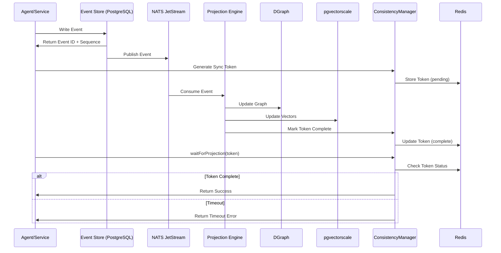
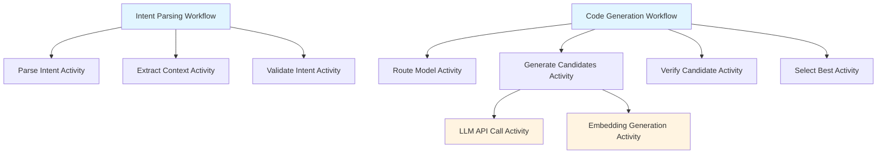

# Design Document: AXIOM Design Refinement

## Document Overview

This design document specifies how to refine the AXIOM platform's design.md and requirements.md documents based on research findings. The refinement focuses on adding architectural components, clarifying consistency patterns, and defining schemas that were identified as gaps during the research phase.

**Version:** 1.0  
**Date:** February 6, 2026  
**Status:** Draft

## Table of Contents

1. [Overview](#1-overview)
2. [Architecture](#2-architecture)
3. [Components and Interfaces](#3-components-and-interfaces)
4. [Data Models](#4-data-models)
5. [Correctness Properties](#5-correctness-properties)
6. [Error Handling](#6-error-handling)
7. [Testing Strategy](#7-testing-strategy)

---

## 1. Overview

### 1.1 Purpose

This design specifies the refinements needed to strengthen the AXIOM architecture before implementation. The refinements address:

- **Memory Consistency**: Adding Projection Engine and ConsistencyManager components
- **Model Configuration**: Moving from hardcoded to dynamic model configuration
- **Authorization**: Defining explicit RBAC enforcement points
- **Temporal Orchestration**: Mapping services to Temporal workflows
- **Data Structures**: Completing ProofCertificate and UserSkillProfile schemas

### 1.2 Scope

**In Scope:**
- Updates to design.md architecture diagrams and component descriptions
- Updates to requirements.md with new functional requirements
- Schema definitions for new data structures
- Interface definitions for new components
- Documentation of consistency patterns and workflows

**Out of Scope:**
- Implementation of code changes
- Database migration scripts
- API endpoint modifications
- Performance testing or benchmarking

### 1.3 Design Principles

1. **Clarity**: All architectural decisions must be unambiguous
2. **Traceability**: Every design element traces to a requirement
3. **Completeness**: No undefined components or interfaces
4. **Consistency**: Terminology and patterns used consistently throughout


## 2. Architecture

### 2.1 Updated High-Level Architecture

The refined architecture adds the Projection Engine and ConsistencyManager components to handle eventual consistency between the event store and read models.

```
┌─────────────────────────────────────────────────────────────────┐
│                    AXIOM PLATFORM (Refined)                     │
├─────────────────────────────────────────────────────────────────┤
│  Frontend Layer (Next.js 14 + gRPC-Web)                        │
│  ├── Intent Canvas    ├── Review Panel    ├── Monitoring       │
│  └── Adaptive Scaffolding (UserSkillProfile-driven)            │
├─────────────────────────────────────────────────────────────────┤
│  AI Security Gateway (Input/Output Validation)                 │
│  └── RBAC Interceptor (NEW)                                    │
├─────────────────────────────────────────────────────────────────┤
│  Semantic Control Plane (Go + gRPC)                           │
│  ├── Intent Service (Temporal Workflows)                       │
│  ├── Economic Control ├── Speculation                          │
│  ├── Learner Model    ├── Orchestration    └── Reasoning      │
│  └── ConsistencyManager (NEW)                                  │
├─────────────────────────────────────────────────────────────────┤
│  AI Layer (Python + FastAPI + gRPC)                           │
│  ├── Model Router (Dynamic Config)                             │
│  ├── SDO Engine       ├── Agent Pool                           │
├─────────────────────────────────────────────────────────────────┤
│  Verification Layer (Rust + WASM + gRPC)                      │
│  ├── Tree-sitter      ├── WASM Sandbox     ├── SMT Portfolio  │
├─────────────────────────────────────────────────────────────────┤
│  Event Processing Layer (NEW)                                  │
│  └── Projection Engine (Go)                                    │
├─────────────────────────────────────────────────────────────────┤
│  Memory Layer (GraphRAG)                                      │
│  ├── pgvectorscale    ├── DGraph           ├── Unified Query  │
├─────────────────────────────────────────────────────────────────┤
│  Infrastructure Layer                                         │
│  ├── PostgreSQL 16    ├── Redis 7          ├── NATS JetStream │
│  └── Kubernetes       └── Observability    └── Security       │
└─────────────────────────────────────────────────────────────────┘
```

### 2.2 Consistency Architecture

The refined architecture implements "Eventual Consistency with Sync Tokens" pattern:




### 2.3 Temporal Workflow Architecture

Core services are mapped to Temporal workflows for durable execution:



**Workflow Definitions:**

- **Intent Parsing Workflow**: Orchestrates intent interpretation with retries
- **Code Generation Workflow**: Manages candidate generation and verification pipeline
- **LLM API Call Activity**: Retrieves completions from model providers (with circuit breaker)
- **Embedding Generation Activity**: Creates vector embeddings for semantic search


## 3. Components and Interfaces

### 3.1 Projection Engine

**Purpose**: Consumes events from NATS JetStream and updates read models in DGraph and pgvectorscale.

**Technology**: Go 1.22

**Interface**:
```go
type ProjectionEngine interface {
    // Start begins consuming events from NATS
    Start(ctx context.Context) error
    
    // Stop gracefully shuts down the engine
    Stop(ctx context.Context) error
    
    // GetProjectionStatus returns the current projection lag
    GetProjectionStatus(ctx context.Context) (*ProjectionStatus, error)
}

type ProjectionStatus struct {
    LastProcessedSequence int64
    CurrentLag            time.Duration
    EventsPerSecond       float64
    HealthStatus          string
}
```

**Implementation Design**:
```go
type projectionEngine struct {
    natsConn      *nats.Conn
    dgraphClient  *dgo.Dgraph
    pgPool        *pgxpool.Pool
    redisClient   *redis.Client
    
    // Event handlers by type
    handlers      map[string]EventHandler
    
    // Metrics
    processedCount atomic.Int64
    errorCount     atomic.Int64
}

func (pe *projectionEngine) Start(ctx context.Context) error {
    // 1. Subscribe to NATS JetStream
    sub, err := pe.natsConn.QueueSubscribe(
        "axiom.events.*",
        "projection-engine",
        pe.handleEvent,
    )
    if err != nil {
        return fmt.Errorf("failed to subscribe: %w", err)
    }
    
    // 2. Process events with at-least-once delivery
    // 3. Update DGraph and pgvectorscale in parallel
    // 4. Emit sync tokens to Redis
    // 5. Handle errors with exponential backoff
    
    return nil
}

func (pe *projectionEngine) handleEvent(msg *nats.Msg) {
    ctx := context.Background()
    
    // 1. Parse event
    event, err := parseEvent(msg.Data)
    if err != nil {
        pe.errorCount.Add(1)
        msg.Nak()
        return
    }
    
    // 2. Route to appropriate handler
    handler, exists := pe.handlers[event.Type]
    if !exists {
        log.Warn("No handler for event type", "type", event.Type)
        msg.Ack()
        return
    }
    
    // 3. Execute projection with timeout
    ctx, cancel := context.WithTimeout(ctx, 30*time.Second)
    defer cancel()
    
    if err := handler.Project(ctx, event); err != nil {
        pe.errorCount.Add(1)
        msg.Nak()
        return
    }
    
    // 4. Mark sync token as complete
    syncToken := fmt.Sprintf("sync:%s:%d", event.AggregateID, event.Sequence)
    pe.redisClient.Set(ctx, syncToken, "complete", 5*time.Minute)
    
    // 5. Acknowledge message
    msg.Ack()
    pe.processedCount.Add(1)
}
```

**Event Handlers**:
```go
type EventHandler interface {
    Project(ctx context.Context, event Event) error
}

type IntentCreatedHandler struct {
    dgraph *dgo.Dgraph
    pg     *pgxpool.Pool
}

func (h *IntentCreatedHandler) Project(ctx context.Context, event Event) error {
    data := event.Data.(IntentCreatedEvent)
    
    // 1. Store in DGraph for relationship tracking
    mutation := &api.Mutation{
        SetJson: marshalIntent(data),
    }
    _, err := h.dgraph.NewTxn().Mutate(ctx, mutation)
    if err != nil {
        return fmt.Errorf("dgraph mutation failed: %w", err)
    }
    
    // 2. Generate embedding and store in pgvectorscale
    embedding := generateEmbedding(data.ParsedIntent.Summary)
    _, err = h.pg.Exec(ctx, `
        INSERT INTO memory_nodes (id, project_id, content, embedding, node_type)
        VALUES ($1, $2, $3, $4, $5)
    `, data.IntentID, data.ProjectID, data.RawIntent, embedding, "intent")
    
    return err
}
```


### 3.2 ConsistencyManager

**Purpose**: Provides read-after-write consistency by allowing agents to wait for projection completion.

**Technology**: Go 1.22 with Redis

**Interface**:
```go
type ConsistencyManager interface {
    // GenerateSyncToken creates a token for tracking projection
    GenerateSyncToken(ctx context.Context, aggregateID string, sequence int64) (string, error)
    
    // WaitForProjection blocks until the projection completes or times out
    WaitForProjection(ctx context.Context, token string, timeout time.Duration) error
    
    // MarkProjectionComplete marks a sync token as complete
    MarkProjectionComplete(ctx context.Context, token string) error
}

type consistencyManager struct {
    redis *redis.Client
}

func (cm *consistencyManager) GenerateSyncToken(
    ctx context.Context,
    aggregateID string,
    sequence int64,
) (string, error) {
    token := fmt.Sprintf("sync:%s:%d", aggregateID, sequence)
    
    // Store token with "pending" status
    err := cm.redis.Set(ctx, token, "pending", 5*time.Minute).Err()
    if err != nil {
        return "", fmt.Errorf("failed to create sync token: %w", err)
    }
    
    return token, nil
}

func (cm *consistencyManager) WaitForProjection(
    ctx context.Context,
    token string,
    timeout time.Duration,
) error {
    ctx, cancel := context.WithTimeout(ctx, timeout)
    defer cancel()
    
    ticker := time.NewTicker(50 * time.Millisecond)
    defer ticker.Stop()
    
    for {
        select {
        case <-ctx.Done():
            return fmt.Errorf("timeout waiting for projection: %w", ctx.Err())
        case <-ticker.C:
            status, err := cm.redis.Get(ctx, token).Result()
            if err == redis.Nil {
                // Token expired, assume projection complete
                return nil
            }
            if err != nil {
                return fmt.Errorf("failed to check token status: %w", err)
            }
            
            if status == "complete" {
                return nil
            }
        }
    }
}

func (cm *consistencyManager) MarkProjectionComplete(
    ctx context.Context,
    token string,
) error {
    return cm.redis.Set(ctx, token, "complete", 5*time.Minute).Err()
}
```

**Usage Example**:
```go
// In Intent Service after writing event
func (s *IntentService) CreateIntent(ctx context.Context, req *CreateIntentRequest) (*Intent, error) {
    // 1. Write event to event store
    event := IntentCreatedEvent{...}
    sequence, err := s.eventStore.AppendEvent(ctx, event)
    if err != nil {
        return nil, err
    }
    
    // 2. Generate sync token
    token, err := s.consistencyMgr.GenerateSyncToken(ctx, req.IntentID, sequence)
    if err != nil {
        return nil, err
    }
    
    // 3. Wait for projection (with timeout)
    err = s.consistencyMgr.WaitForProjection(ctx, token, 5*time.Second)
    if err != nil {
        log.Warn("Projection timeout, returning stale read warning", "error", err)
        // Continue anyway - eventual consistency
    }
    
    // 4. Read from projection (DGraph/pgvectorscale)
    intent, err := s.memoryLayer.GetIntent(ctx, req.IntentID)
    return intent, err
}
```


### 3.3 Dynamic Model Configuration

**Purpose**: Load model configurations from database instead of hardcoded maps.

**Technology**: Python 3.12 with SQLAlchemy

**Database Schema**:
```sql
CREATE TABLE model_configurations (
    id UUID PRIMARY KEY DEFAULT gen_random_uuid(),
    name VARCHAR(100) NOT NULL UNIQUE,
    provider VARCHAR(50) NOT NULL,
    model_id VARCHAR(100) NOT NULL,
    tier model_tier_enum NOT NULL,
    cost_per_1k_tokens DECIMAL(8,6) NOT NULL,
    accuracy_score DECIMAL(3,2) CHECK (accuracy_score BETWEEN 0 AND 1),
    capabilities JSONB DEFAULT '{}',
    is_active BOOLEAN DEFAULT true,
    created_at TIMESTAMP WITH TIME ZONE DEFAULT NOW(),
    updated_at TIMESTAMP WITH TIME ZONE DEFAULT NOW()
);

CREATE INDEX model_configurations_tier_idx ON model_configurations (tier, is_active);
CREATE INDEX model_configurations_provider_idx ON model_configurations (provider);

-- Example data
INSERT INTO model_configurations (name, provider, model_id, tier, cost_per_1k_tokens, accuracy_score, capabilities) VALUES
('deepseek-v3', 'deepseek', 'deepseek-chat', 'balanced', 0.002, 0.90, '{"code_generation": true, "reasoning": true}'),
('claude-sonnet-4', 'anthropic', 'claude-sonnet-4-20250514', 'high_accuracy', 0.015, 0.92, '{"code_generation": true, "reasoning": true, "long_context": true}'),
('gpt-4o', 'openai', 'gpt-4o-2024-11-20', 'high_accuracy', 0.030, 0.91, '{"code_generation": true, "vision": true}'),
('qwen3-8b', 'local', 'qwen3-8b-instruct', 'local', 0.000, 0.75, '{"code_generation": true}');
```

**Model Router Refactoring**:
```python
from sqlalchemy import select
from sqlalchemy.ext.asyncio import AsyncSession
from typing import List, Optional
import asyncio

class DynamicModelConfig:
    def __init__(self, db_session: AsyncSession, cache_ttl: int = 60):
        self.db = db_session
        self.cache_ttl = cache_ttl
        self._cache: Dict[str, ModelConfig] = {}
        self._cache_timestamp: Optional[datetime] = None
        self._lock = asyncio.Lock()
    
    async def get_models_by_tier(self, tier: ModelTier) -> List[ModelConfig]:
        """Get all active models for a given tier"""
        await self._refresh_cache_if_needed()
        
        return [
            config for config in self._cache.values()
            if config.tier == tier and config.is_active
        ]
    
    async def get_model_by_name(self, name: str) -> Optional[ModelConfig]:
        """Get a specific model configuration by name"""
        await self._refresh_cache_if_needed()
        return self._cache.get(name)
    
    async def _refresh_cache_if_needed(self):
        """Refresh cache if TTL expired"""
        now = datetime.utcnow()
        
        if (self._cache_timestamp is None or 
            (now - self._cache_timestamp).total_seconds() > self.cache_ttl):
            
            async with self._lock:
                # Double-check after acquiring lock
                if (self._cache_timestamp is None or 
                    (now - self._cache_timestamp).total_seconds() > self.cache_ttl):
                    await self._load_from_database()
                    self._cache_timestamp = now
    
    async def _load_from_database(self):
        """Load all active model configurations from database"""
        stmt = select(ModelConfiguration).where(
            ModelConfiguration.is_active == True
        )
        result = await self.db.execute(stmt)
        configs = result.scalars().all()
        
        self._cache = {
            config.name: ModelConfig(
                name=config.name,
                provider=config.provider,
                model_id=config.model_id,
                tier=config.tier,
                cost_per_1k=config.cost_per_1k_tokens,
                accuracy=config.accuracy_score,
                capabilities=config.capabilities
            )
            for config in configs
        }
        
        log.info(f"Loaded {len(self._cache)} model configurations from database")

class ModelRouter:
    def __init__(self, model_config: DynamicModelConfig):
        self.model_config = model_config
        self.circuit_breakers: Dict[str, CircuitBreaker] = {}
    
    async def route_request(
        self,
        request: GenerationRequest,
        user_prefs: UserModelPreferences
    ) -> ModelConfig:
        # 1. Check user override
        if user_prefs.preferred_model:
            model = await self.model_config.get_model_by_name(user_prefs.preferred_model)
            if model and self._check_circuit_breaker(model.name):
                return model
        
        # 2. Get default tier models
        tier = user_prefs.default_tier or ModelTier.BALANCED
        models = await self.model_config.get_models_by_tier(tier)
        
        # 3. Filter by circuit breaker status
        available_models = [
            m for m in models 
            if self._check_circuit_breaker(m.name)
        ]
        
        if not available_models:
            raise NoAvailableModelsError(f"No available models for tier {tier}")
        
        # 4. Select best model (by accuracy, then cost)
        return max(available_models, key=lambda m: (m.accuracy, -m.cost_per_1k))
    
    def _check_circuit_breaker(self, model_name: str) -> bool:
        """Check if circuit breaker allows requests to this model"""
        cb = self.circuit_breakers.get(model_name)
        if cb is None:
            cb = CircuitBreaker(failure_threshold=3, timeout=60)
            self.circuit_breakers[model_name] = cb
        
        return cb.is_closed()
```


### 3.4 RBAC Interceptor

**Purpose**: Enforce role-based access control at the gRPC layer.

**Technology**: Go 1.22 with gRPC interceptors

**Implementation**:
```go
type RBACInterceptor struct {
    authzService AuthorizationService
    jwtValidator JWTValidator
}

func (i *RBACInterceptor) UnaryInterceptor() grpc.UnaryServerInterceptor {
    return func(
        ctx context.Context,
        req interface{},
        info *grpc.UnaryServerInfo,
        handler grpc.UnaryHandler,
    ) (interface{}, error) {
        // 1. Extract JWT from metadata
        token, err := i.extractToken(ctx)
        if err != nil {
            return nil, status.Error(codes.Unauthenticated, "missing or invalid token")
        }
        
        // 2. Validate and parse JWT
        claims, err := i.jwtValidator.Validate(token)
        if err != nil {
            return nil, status.Error(codes.Unauthenticated, "invalid token")
        }
        
        // 3. Check permissions for this RPC
        permission := i.getRequiredPermission(info.FullMethod)
        if permission == "" {
            // No permission required (public endpoint)
            return handler(ctx, req)
        }
        
        // 4. Extract resource ID from request
        resourceID := i.extractResourceID(req)
        
        // 5. Check authorization
        user := &User{
            ID:   claims.Sub,
            Role: claims.Role,
            OrgID: claims.OrgID,
        }
        
        if !i.authzService.HasPermission(user, permission, resourceID) {
            return nil, status.Error(codes.PermissionDenied, "insufficient permissions")
        }
        
        // 6. Add user context and proceed
        ctx = context.WithValue(ctx, "user", user)
        return handler(ctx, req)
    }
}

func (i *RBACInterceptor) getRequiredPermission(method string) Permission {
    // Map gRPC methods to required permissions
    permissionMap := map[string]Permission{
        "/axiom.generation.v1.GenerationService/GenerateStream": PermissionCreateIVCU,
        "/axiom.generation.v1.GenerationService/GetGeneration":  PermissionReadIVCU,
        "/axiom.intent.v1.IntentService/CreateIntent":           PermissionCreateIVCU,
        "/axiom.intent.v1.IntentService/GetIntent":              PermissionReadIVCU,
        "/axiom.intent.v1.IntentService/UpdateIntent":           PermissionUpdateIVCU,
        "/axiom.intent.v1.IntentService/DeleteIntent":           PermissionDeleteIVCU,
        "/axiom.project.v1.ProjectService/CreateProject":        PermissionWriteProject,
        "/axiom.project.v1.ProjectService/DeleteProject":        PermissionDeleteProject,
    }
    
    return permissionMap[method]
}

func (i *RBACInterceptor) extractResourceID(req interface{}) string {
    // Use reflection to extract resource ID from request
    // Look for common field names: project_id, ivcu_id, id
    v := reflect.ValueOf(req)
    if v.Kind() == reflect.Ptr {
        v = v.Elem()
    }
    
    for _, fieldName := range []string{"ProjectId", "IvcuId", "Id"} {
        field := v.FieldByName(fieldName)
        if field.IsValid() && field.Kind() == reflect.String {
            return field.String()
        }
    }
    
    return ""
}
```

**Integration with gRPC Server**:
```go
func NewGRPCServer(rbacInterceptor *RBACInterceptor) *grpc.Server {
    return grpc.NewServer(
        grpc.ChainUnaryInterceptor(
            rbacInterceptor.UnaryInterceptor(),
            loggingInterceptor(),
            metricsInterceptor(),
        ),
        grpc.ChainStreamInterceptor(
            rbacInterceptor.StreamInterceptor(),
            loggingStreamInterceptor(),
        ),
    )
}
```


### 3.5 Temporal Workflow Definitions

**Purpose**: Define core services as Temporal workflows for durable execution.

**Technology**: Go 1.22 with Temporal SDK

**Intent Parsing Workflow**:
```go
type IntentParsingWorkflow struct{}

type IntentParsingInput struct {
    RawIntent   string
    ProjectID   string
    UserID      string
    ContextHints []string
}

type IntentParsingOutput struct {
    ParsedIntent IntentSpec
    Confidence   float64
    Suggestions  []Refinement
}

func (w *IntentParsingWorkflow) Execute(
    ctx workflow.Context,
    input IntentParsingInput,
) (*IntentParsingOutput, error) {
    // Configure activity options
    ao := workflow.ActivityOptions{
        StartToCloseTimeout: 30 * time.Second,
        RetryPolicy: &temporal.RetryPolicy{
            InitialInterval:    time.Second,
            BackoffCoefficient: 2.0,
            MaximumInterval:    time.Minute,
            MaximumAttempts:    3,
        },
    }
    ctx = workflow.WithActivityOptions(ctx, ao)
    
    // 1. Extract context from project memory
    var contextData ContextData
    err := workflow.ExecuteActivity(ctx, ExtractContextActivity, input.ProjectID).Get(ctx, &contextData)
    if err != nil {
        return nil, fmt.Errorf("failed to extract context: %w", err)
    }
    
    // 2. Parse intent with NLP
    var parsedIntent IntentSpec
    err = workflow.ExecuteActivity(ctx, ParseIntentActivity, input.RawIntent, contextData).Get(ctx, &parsedIntent)
    if err != nil {
        return nil, fmt.Errorf("failed to parse intent: %w", err)
    }
    
    // 3. Validate consistency
    var validationResult ValidationResult
    err = workflow.ExecuteActivity(ctx, ValidateIntentActivity, parsedIntent).Get(ctx, &validationResult)
    if err != nil {
        return nil, fmt.Errorf("failed to validate intent: %w", err)
    }
    
    // 4. Generate refinement suggestions if confidence is low
    var suggestions []Refinement
    if validationResult.Confidence < 0.8 {
        err = workflow.ExecuteActivity(ctx, GenerateSuggestionsActivity, parsedIntent).Get(ctx, &suggestions)
        if err != nil {
            workflow.GetLogger(ctx).Warn("Failed to generate suggestions", "error", err)
            // Non-critical, continue
        }
    }
    
    return &IntentParsingOutput{
        ParsedIntent: parsedIntent,
        Confidence:   validationResult.Confidence,
        Suggestions:  suggestions,
    }, nil
}
```

**Code Generation Workflow**:
```go
type CodeGenerationWorkflow struct{}

type CodeGenerationInput struct {
    IntentID    string
    IntentSpec  IntentSpec
    ModelConfig ModelConfig
    VerificationConfig VerificationConfig
}

type CodeGenerationOutput struct {
    IVCU IVCU
    ProofCertificate ProofCertificate
}

func (w *CodeGenerationWorkflow) Execute(
    ctx workflow.Context,
    input CodeGenerationInput,
) (*CodeGenerationOutput, error) {
    // Configure activity options with longer timeouts
    ao := workflow.ActivityOptions{
        StartToCloseTimeout: 5 * time.Minute,
        HeartbeatTimeout:    30 * time.Second,
        RetryPolicy: &temporal.RetryPolicy{
            InitialInterval:    2 * time.Second,
            BackoffCoefficient: 2.0,
            MaximumInterval:    5 * time.Minute,
            MaximumAttempts:    3,
        },
    }
    ctx = workflow.WithActivityOptions(ctx, ao)
    
    // 1. Route to appropriate model
    var selectedModel ModelConfig
    err := workflow.ExecuteActivity(ctx, RouteModelActivity, input.ModelConfig).Get(ctx, &selectedModel)
    if err != nil {
        return nil, fmt.Errorf("failed to route model: %w", err)
    }
    
    // 2. Generate candidates (with SDO)
    var candidates []Candidate
    err = workflow.ExecuteActivity(ctx, GenerateCandidatesActivity, input.IntentSpec, selectedModel).Get(ctx, &candidates)
    if err != nil {
        return nil, fmt.Errorf("failed to generate candidates: %w", err)
    }
    
    // 3. Verify candidates in parallel
    var verifiedCandidates []VerifiedCandidate
    futures := make([]workflow.Future, len(candidates))
    
    for i, candidate := range candidates {
        futures[i] = workflow.ExecuteActivity(ctx, VerifyCandidateActivity, candidate, input.VerificationConfig)
    }
    
    for _, future := range futures {
        var verified VerifiedCandidate
        if err := future.Get(ctx, &verified); err == nil && verified.Passed {
            verifiedCandidates = append(verifiedCandidates, verified)
        }
    }
    
    if len(verifiedCandidates) == 0 {
        // Auto-upgrade if enabled
        if input.ModelConfig.AutoUpgradeEnabled {
            return w.retryWithUpgradedModel(ctx, input)
        }
        return nil, fmt.Errorf("no candidates passed verification")
    }
    
    // 4. Select best candidate
    var bestCandidate VerifiedCandidate
    err = workflow.ExecuteActivity(ctx, SelectBestCandidateActivity, verifiedCandidates).Get(ctx, &bestCandidate)
    if err != nil {
        return nil, fmt.Errorf("failed to select best candidate: %w", err)
    }
    
    // 5. Generate proof certificate
    var proofCert ProofCertificate
    err = workflow.ExecuteActivity(ctx, GenerateProofActivity, bestCandidate).Get(ctx, &proofCert)
    if err != nil {
        return nil, fmt.Errorf("failed to generate proof: %w", err)
    }
    
    // 6. Create IVCU
    ivcu := IVCU{
        ID:                  input.IntentID,
        Code:                bestCandidate.Code,
        VerificationResult:  bestCandidate.VerificationResult,
        ProofCertificateID:  proofCert.ID,
        ConfidenceScore:     bestCandidate.Confidence,
    }
    
    return &CodeGenerationOutput{
        IVCU:             ivcu,
        ProofCertificate: proofCert,
    }, nil
}
```

**Activity Definitions**:
```go
// LLM API Call Activity with circuit breaker
func LLMAPICallActivity(ctx context.Context, prompt string, model ModelConfig) (string, error) {
    // 1. Check circuit breaker
    cb := getCircuitBreaker(model.Name)
    if !cb.IsAllowed() {
        return "", fmt.Errorf("circuit breaker open for model %s", model.Name)
    }
    
    // 2. Make API call with timeout
    ctx, cancel := context.WithTimeout(ctx, 60*time.Second)
    defer cancel()
    
    response, err := callLLMAPI(ctx, prompt, model)
    if err != nil {
        cb.RecordFailure()
        return "", err
    }
    
    cb.RecordSuccess()
    return response, nil
}

// Embedding Generation Activity
func EmbeddingGenerationActivity(ctx context.Context, text string) ([]float64, error) {
    ctx, cancel := context.WithTimeout(ctx, 10*time.Second)
    defer cancel()
    
    return generateEmbedding(ctx, text)
}
```


## 4. Data Models

### 4.1 ProofCertificate Schema

**Purpose**: Complete schema for cryptographic verification evidence.

**Database Schema**:
```sql
CREATE TABLE proof_certificates (
    id UUID PRIMARY KEY DEFAULT gen_random_uuid(),
    ivcu_id UUID NOT NULL REFERENCES ivcus(id),
    
    -- Proof metadata
    proof_type proof_type_enum NOT NULL,
    verifier_version VARCHAR(50) NOT NULL,
    timestamp TIMESTAMP WITH TIME ZONE DEFAULT NOW(),
    
    -- Traceability
    intent_id UUID NOT NULL,
    
    -- Cryptographic data
    ast_hash VARCHAR(64) NOT NULL,  -- SHA-256 hash of AST
    code_hash VARCHAR(64) NOT NULL,  -- SHA-256 hash of code
    
    -- Verification signatures
    verifier_signatures JSONB NOT NULL,  -- Array of {verifier: string, signature: string}
    
    -- Formal assertions
    assertions JSONB NOT NULL,
    
    -- Proof data (SMT solver output, test results, etc.)
    proof_data BYTEA NOT NULL,
    
    -- Hash chain for tamper detection
    hash_chain VARCHAR(128) NOT NULL,
    
    -- Master signature
    signature BYTEA NOT NULL,
    
    created_at TIMESTAMP WITH TIME ZONE DEFAULT NOW(),
    
    UNIQUE(ivcu_id, proof_type)
);

CREATE INDEX proof_certificates_intent_idx ON proof_certificates (intent_id);
CREATE INDEX proof_certificates_hash_chain_idx ON proof_certificates (hash_chain);
CREATE INDEX proof_certificates_timestamp_idx ON proof_certificates (timestamp DESC);
```

**Go Struct**:
```go
type ProofCertificate struct {
    ID               string                 `json:"id"`
    IVCUID           string                 `json:"ivcu_id"`
    ProofType        ProofType              `json:"proof_type"`
    VerifierVersion  string                 `json:"verifier_version"`
    Timestamp        time.Time              `json:"timestamp"`
    IntentID         string                 `json:"intent_id"`
    ASTHash          string                 `json:"ast_hash"`
    CodeHash         string                 `json:"code_hash"`
    VerifierSignatures []VerifierSignature  `json:"verifier_signatures"`
    Assertions       []FormalAssertion      `json:"assertions"`
    ProofData        []byte                 `json:"proof_data"`
    HashChain        string                 `json:"hash_chain"`
    Signature        []byte                 `json:"signature"`
    CreatedAt        time.Time              `json:"created_at"`
}

type VerifierSignature struct {
    Verifier  string `json:"verifier"`   // e.g., "tree-sitter", "z3", "wasm-sandbox"
    Signature string `json:"signature"`  // Cryptographic signature
    Timestamp time.Time `json:"timestamp"`
}

type FormalAssertion struct {
    Type        string `json:"type"`         // e.g., "type_safety", "memory_safety"
    Description string `json:"description"`
    Verified    bool   `json:"verified"`
    Evidence    string `json:"evidence"`     // Reference to proof data
}

type ProofType string

const (
    ProofTypeTypeSafety       ProofType = "type_safety"
    ProofTypeMemorySafety     ProofType = "memory_safety"
    ProofTypeContractCompliance ProofType = "contract_compliance"
    ProofTypePropertyBased    ProofType = "property_based"
)
```

**Validation Algorithm**:
```go
func ValidateProofCertificate(cert *ProofCertificate, code string) error {
    // 1. Verify code hash
    computedCodeHash := sha256.Sum256([]byte(code))
    if hex.EncodeToString(computedCodeHash[:]) != cert.CodeHash {
        return fmt.Errorf("code hash mismatch")
    }
    
    // 2. Verify AST hash
    ast, err := parseAST(code)
    if err != nil {
        return fmt.Errorf("failed to parse AST: %w", err)
    }
    computedASTHash := sha256.Sum256([]byte(ast.String()))
    if hex.EncodeToString(computedASTHash[:]) != cert.ASTHash {
        return fmt.Errorf("AST hash mismatch")
    }
    
    // 3. Verify hash chain
    expectedHashChain := computeHashChain(cert)
    if expectedHashChain != cert.HashChain {
        return fmt.Errorf("hash chain mismatch")
    }
    
    // 4. Verify master signature
    publicKey, err := loadPublicKey()
    if err != nil {
        return fmt.Errorf("failed to load public key: %w", err)
    }
    
    if !verifySignature(publicKey, []byte(cert.HashChain), cert.Signature) {
        return fmt.Errorf("signature verification failed")
    }
    
    // 5. Verify individual verifier signatures
    for _, vs := range cert.VerifierSignatures {
        verifierKey, err := loadVerifierPublicKey(vs.Verifier)
        if err != nil {
            return fmt.Errorf("failed to load verifier key: %w", err)
        }
        
        if !verifySignature(verifierKey, []byte(cert.CodeHash), []byte(vs.Signature)) {
            return fmt.Errorf("verifier signature failed: %s", vs.Verifier)
        }
    }
    
    return nil
}

func computeHashChain(cert *ProofCertificate) string {
    // Concatenate all hashes and compute final hash
    data := fmt.Sprintf("%s:%s:%s:%s",
        cert.CodeHash,
        cert.ASTHash,
        cert.IntentID,
        cert.Timestamp.Format(time.RFC3339),
    )
    
    hash := sha256.Sum256([]byte(data))
    return hex.EncodeToString(hash[:])
}
```


### 4.2 UserSkillProfile Schema

**Purpose**: Track user expertise for adaptive UI complexity.

**Database Schema**:
```sql
CREATE TABLE user_skill_profiles (
    id UUID PRIMARY KEY DEFAULT gen_random_uuid(),
    user_id UUID NOT NULL REFERENCES users(id) UNIQUE,
    
    -- Skill level
    skill_level skill_level_enum NOT NULL DEFAULT 'beginner',
    confidence_score DECIMAL(3,2) CHECK (confidence_score BETWEEN 0 AND 1),
    
    -- Interaction metrics
    total_intents_created INTEGER DEFAULT 0,
    successful_generations INTEGER DEFAULT 0,
    refinement_count INTEGER DEFAULT 0,
    avg_intent_complexity DECIMAL(3,2),
    
    -- Feature usage tracking
    features_used JSONB DEFAULT '{}',
    advanced_features_count INTEGER DEFAULT 0,
    
    -- Learning progression
    onboarding_completed BOOLEAN DEFAULT false,
    tutorials_completed TEXT[] DEFAULT '{}',
    last_skill_assessment TIMESTAMP WITH TIME ZONE,
    
    -- Timestamps
    created_at TIMESTAMP WITH TIME ZONE DEFAULT NOW(),
    updated_at TIMESTAMP WITH TIME ZONE DEFAULT NOW()
);

CREATE TYPE skill_level_enum AS ENUM ('beginner', 'intermediate', 'advanced');

CREATE INDEX user_skill_profiles_user_idx ON user_skill_profiles (user_id);
CREATE INDEX user_skill_profiles_level_idx ON user_skill_profiles (skill_level);
```

**Go Struct**:
```go
type UserSkillProfile struct {
    ID                    string            `json:"id"`
    UserID                string            `json:"user_id"`
    SkillLevel            SkillLevel        `json:"skill_level"`
    ConfidenceScore       float64           `json:"confidence_score"`
    TotalIntentsCreated   int               `json:"total_intents_created"`
    SuccessfulGenerations int               `json:"successful_generations"`
    RefinementCount       int               `json:"refinement_count"`
    AvgIntentComplexity   float64           `json:"avg_intent_complexity"`
    FeaturesUsed          map[string]int    `json:"features_used"`
    AdvancedFeaturesCount int               `json:"advanced_features_count"`
    OnboardingCompleted   bool              `json:"onboarding_completed"`
    TutorialsCompleted    []string          `json:"tutorials_completed"`
    LastSkillAssessment   time.Time         `json:"last_skill_assessment"`
    CreatedAt             time.Time         `json:"created_at"`
    UpdatedAt             time.Time         `json:"updated_at"`
}

type SkillLevel string

const (
    SkillLevelBeginner     SkillLevel = "beginner"
    SkillLevelIntermediate SkillLevel = "intermediate"
    SkillLevelAdvanced     SkillLevel = "advanced"
)
```

**Skill Level Calculation Heuristic**:
```go
type SkillCalculator struct{}

func (sc *SkillCalculator) CalculateSkillLevel(profile *UserSkillProfile) SkillLevel {
    score := 0.0
    
    // 1. Success rate (weight: 0.3)
    if profile.TotalIntentsCreated > 0 {
        successRate := float64(profile.SuccessfulGenerations) / float64(profile.TotalIntentsCreated)
        score += successRate * 0.3
    }
    
    // 2. Intent complexity (weight: 0.25)
    if profile.AvgIntentComplexity > 0 {
        // Normalize to 0-1 range (assuming max complexity is 10)
        normalizedComplexity := math.Min(profile.AvgIntentComplexity/10.0, 1.0)
        score += normalizedComplexity * 0.25
    }
    
    // 3. Advanced feature usage (weight: 0.25)
    if profile.TotalIntentsCreated > 0 {
        advancedFeatureRate := float64(profile.AdvancedFeaturesCount) / float64(profile.TotalIntentsCreated)
        score += math.Min(advancedFeatureRate, 1.0) * 0.25
    }
    
    // 4. Refinement efficiency (weight: 0.2)
    // Lower refinement count per intent indicates higher skill
    if profile.TotalIntentsCreated > 0 {
        avgRefinements := float64(profile.RefinementCount) / float64(profile.TotalIntentsCreated)
        refinementScore := math.Max(0, 1.0 - (avgRefinements / 5.0)) // Assume 5+ refinements = beginner
        score += refinementScore * 0.2
    }
    
    // Map score to skill level
    if score < 0.4 {
        return SkillLevelBeginner
    } else if score < 0.7 {
        return SkillLevelIntermediate
    } else {
        return SkillLevelAdvanced
    }
}

func (sc *SkillCalculator) UpdateProfile(profile *UserSkillProfile, event UserEvent) {
    switch event.Type {
    case EventIntentCreated:
        profile.TotalIntentsCreated++
        profile.AvgIntentComplexity = sc.calculateIntentComplexity(event.Intent)
        
    case EventGenerationSuccessful:
        profile.SuccessfulGenerations++
        
    case EventIntentRefined:
        profile.RefinementCount++
        
    case EventAdvancedFeatureUsed:
        profile.AdvancedFeaturesCount++
        featureName := event.FeatureName
        profile.FeaturesUsed[featureName]++
    }
    
    // Recalculate skill level
    profile.SkillLevel = sc.CalculateSkillLevel(profile)
    profile.ConfidenceScore = sc.calculateConfidence(profile)
    profile.UpdatedAt = time.Now()
}

func (sc *SkillCalculator) calculateIntentComplexity(intent string) float64 {
    // Simple heuristic based on:
    // - Length
    // - Number of constraints
    // - Technical terminology density
    
    complexity := 0.0
    
    // Length factor (0-3 points)
    wordCount := len(strings.Fields(intent))
    complexity += math.Min(float64(wordCount)/50.0, 3.0)
    
    // Constraint keywords (0-4 points)
    constraintKeywords := []string{"must", "should", "shall", "require", "ensure", "verify"}
    for _, keyword := range constraintKeywords {
        if strings.Contains(strings.ToLower(intent), keyword) {
            complexity += 0.5
        }
    }
    complexity = math.Min(complexity, 7.0)
    
    // Technical terms (0-3 points)
    technicalTerms := []string{"api", "database", "authentication", "async", "concurrent", "algorithm"}
    for _, term := range technicalTerms {
        if strings.Contains(strings.ToLower(intent), term) {
            complexity += 0.5
        }
    }
    
    return math.Min(complexity, 10.0)
}
```


### 4.3 UI Complexity Mapping

**Purpose**: Define how UI adapts based on user skill level.

**Feature Visibility Matrix**:
```typescript
interface FeatureVisibility {
  feature: string;
  beginner: boolean;
  intermediate: boolean;
  advanced: boolean;
  description: string;
}

const FEATURE_VISIBILITY_MATRIX: FeatureVisibility[] = [
  {
    feature: "basic_intent_input",
    beginner: true,
    intermediate: true,
    advanced: true,
    description: "Simple text input for intent"
  },
  {
    feature: "model_selection",
    beginner: false,
    intermediate: true,
    advanced: true,
    description: "Dropdown to select LLM model"
  },
  {
    feature: "verification_tier_control",
    beginner: false,
    intermediate: false,
    advanced: true,
    description: "Control which verification tiers to run"
  },
  {
    feature: "constraint_tagging",
    beginner: false,
    intermediate: true,
    advanced: true,
    description: "Tag constraints in intent"
  },
  {
    feature: "counterfactual_explorer",
    beginner: false,
    intermediate: false,
    advanced: true,
    description: "Explore 'what if' scenarios"
  },
  {
    feature: "proof_certificate_details",
    beginner: false,
    intermediate: true,
    advanced: true,
    description: "View detailed proof certificate"
  },
  {
    feature: "sdo_strategy_selection",
    beginner: false,
    intermediate: false,
    advanced: true,
    description: "Choose SDO generation strategy"
  },
  {
    feature: "cost_estimation",
    beginner: true,
    intermediate: true,
    advanced: true,
    description: "View estimated cost before generation"
  },
  {
    feature: "advanced_refinement_suggestions",
    beginner: false,
    intermediate: true,
    advanced: true,
    description: "Detailed refinement suggestions with rationale"
  },
  {
    feature: "memory_graph_visualization",
    beginner: false,
    intermediate: false,
    advanced: true,
    description: "Visualize project memory graph"
  }
];
```

**Progressive Disclosure Strategy**:
```typescript
class AdaptiveUIController {
  private skillProfile: UserSkillProfile;
  
  constructor(skillProfile: UserSkillProfile) {
    this.skillProfile = skillProfile;
  }
  
  getVisibleFeatures(): string[] {
    const level = this.skillProfile.skill_level;
    
    return FEATURE_VISIBILITY_MATRIX
      .filter(f => f[level] === true)
      .map(f => f.feature);
  }
  
  shouldShowFeature(featureName: string): boolean {
    const feature = FEATURE_VISIBILITY_MATRIX.find(f => f.feature === featureName);
    if (!feature) return false;
    
    const level = this.skillProfile.skill_level;
    return feature[level] === true;
  }
  
  getUIComplexityLevel(): UIComplexityLevel {
    switch (this.skillProfile.skill_level) {
      case 'beginner':
        return {
          layout: 'simplified',
          showTooltips: true,
          showOnboarding: !this.skillProfile.onboarding_completed,
          defaultExpanded: false,
          showAdvancedOptions: false
        };
      
      case 'intermediate':
        return {
          layout: 'standard',
          showTooltips: true,
          showOnboarding: false,
          defaultExpanded: false,
          showAdvancedOptions: true
        };
      
      case 'advanced':
        return {
          layout: 'power_user',
          showTooltips: false,
          showOnboarding: false,
          defaultExpanded: true,
          showAdvancedOptions: true
        };
    }
  }
  
  // Progressive disclosure: show advanced features after user demonstrates proficiency
  shouldPromoteFeature(featureName: string): boolean {
    const feature = FEATURE_VISIBILITY_MATRIX.find(f => f.feature === featureName);
    if (!feature) return false;
    
    const currentLevel = this.skillProfile.skill_level;
    
    // Check if user is ready for next level features
    if (currentLevel === 'beginner' && this.skillProfile.confidence_score > 0.6) {
      return feature.intermediate && !feature.beginner;
    }
    
    if (currentLevel === 'intermediate' && this.skillProfile.confidence_score > 0.8) {
      return feature.advanced && !feature.intermediate;
    }
    
    return false;
  }
}

interface UIComplexityLevel {
  layout: 'simplified' | 'standard' | 'power_user';
  showTooltips: boolean;
  showOnboarding: boolean;
  defaultExpanded: boolean;
  showAdvancedOptions: boolean;
}
```


## 5. Correctness Properties

A property is a characteristic or behavior that should hold true across all valid executions of a system—essentially, a formal statement about what the system should do. Properties serve as the bridge between human-readable specifications and machine-verifiable correctness guarantees.

For this design refinement, properties focus on documentation completeness and consistency rather than runtime behavior, since the goal is to refine documentation artifacts.

### Property 1: Architecture Diagram Completeness

*For any* architecture diagram in the design document, it should include all new components: Projection_Engine, ConsistencyManager, and RBAC_Interceptor.

**Validates: Requirements 1.1, 4.1, 9.1**

### Property 2: Schema Field Completeness

*For any* data schema defined in the design document (DynamicModelConfig, ProofCertificate, UserSkillProfile), all required fields specified in the requirements should be present in the schema definition.

**Validates: Requirements 3.2, 5.1, 5.2, 5.3, 5.4, 7.1**

### Property 3: Terminology Consistency

*For any* term defined in the requirements glossary, all occurrences of that term in the design document should use the exact glossary definition (e.g., "Projection_Engine" not "projection engine" or "ProjectionEngine").

**Validates: Requirements 9.4**

### Property 4: Component Interface Completeness

*For any* new component (Projection_Engine, ConsistencyManager, ModelRouter, RBAC_Interceptor), the design document should include interface definitions with method signatures.

**Validates: Requirements 2.1, 3.1, 4.2**

### Property 5: Temporal Workflow Definition Completeness

*For any* core service operation (intent parsing, code generation, LLM API calls, embedding generation), the design document should define it as either a Temporal Workflow or Temporal Activity with retry policies and timeouts.

**Validates: Requirements 6.1, 6.2, 6.3, 6.4, 6.5**

### Property 6: Performance Target Documentation

*For any* performance-critical component (Projection_Engine, ConsistencyManager, ModelRouter, RBAC_Interceptor), the design document should specify quantitative performance targets with specific latency or throughput values.

**Validates: Requirements 11.1, 11.2, 11.3, 11.4**

### Property 7: Backward Compatibility Specification

*For any* component that modifies existing systems (API contracts, database schemas, event schemas), the design document should specify backward compatibility constraints.

**Validates: Requirements 12.1, 12.2, 12.3**


## 6. Error Handling

### 6.1 Documentation Errors

**Missing Component Documentation**:
- **Error**: Required component (Projection_Engine, ConsistencyManager, etc.) not documented
- **Handling**: Review requirements checklist, add missing component section
- **Prevention**: Use requirements traceability matrix during writing

**Incomplete Schema Definition**:
- **Error**: Schema missing required fields from requirements
- **Handling**: Cross-reference with requirements, add missing fields
- **Prevention**: Use schema validation checklist

**Inconsistent Terminology**:
- **Error**: Terms used inconsistently across document
- **Handling**: Search and replace with glossary terms
- **Prevention**: Use glossary reference during writing

### 6.2 Design Errors

**Missing Interface Definitions**:
- **Error**: Component described but interface not defined
- **Handling**: Add interface definition with method signatures
- **Prevention**: Follow component documentation template

**Incomplete Workflow Definitions**:
- **Error**: Temporal workflow missing retry policies or timeouts
- **Handling**: Add missing configuration with reasonable defaults
- **Prevention**: Use workflow definition checklist

**Missing Performance Targets**:
- **Error**: Component described without performance targets
- **Handling**: Add quantitative targets based on system requirements
- **Prevention**: Include performance section in component template

### 6.3 Validation Errors

**Requirements Traceability Gaps**:
- **Error**: Design element not traced to requirement
- **Handling**: Add requirement reference or remove orphaned element
- **Prevention**: Maintain traceability matrix during writing

**Cross-Reference Errors**:
- **Error**: Section reference points to non-existent section
- **Handling**: Update reference or create missing section
- **Prevention**: Validate all cross-references before finalization


## 7. Testing Strategy

### 7.1 Documentation Testing Approach

Since this spec focuses on refining documentation artifacts rather than implementing code, the testing strategy emphasizes documentation validation and completeness checking.

**Dual Testing Approach**:
- **Manual Review**: Human review of documentation for clarity, completeness, and consistency
- **Automated Validation**: Scripts to verify documentation properties

### 7.2 Manual Review Tests

**Completeness Review**:
- Verify all requirements are addressed in design document
- Check that all new components have complete descriptions
- Ensure all schemas include required fields
- Validate that all interfaces are fully defined

**Consistency Review**:
- Check terminology consistency against glossary
- Verify cross-references are accurate
- Ensure architecture diagrams match component descriptions
- Validate that code examples are syntactically correct

**Clarity Review**:
- Assess whether component descriptions are unambiguous
- Verify that workflows are easy to follow
- Check that examples illustrate key concepts effectively
- Ensure technical decisions are justified

### 7.3 Automated Validation Tests

**Property-Based Tests**:

Each correctness property should be validated with automated tests. These tests will run against the refined design.md and requirements.md files.

**Test Configuration**:
- Minimum 100 iterations per property test (to handle variations in document structure)
- Each test references its design document property
- Tag format: **Feature: design-refinement, Property {number}: {property_text}**

**Property Test 1: Architecture Diagram Completeness**
```python
# Feature: design-refinement, Property 1: Architecture Diagram Completeness
def test_architecture_diagram_includes_new_components():
    """Verify architecture diagrams include all new components"""
    design_content = read_file("design.md")
    
    required_components = [
        "Projection_Engine",
        "ConsistencyManager",
        "RBAC_Interceptor"
    ]
    
    # Find architecture diagram sections
    diagram_sections = extract_sections(design_content, pattern=r"```.*?```", flags=re.DOTALL)
    
    for component in required_components:
        assert any(component in section for section in diagram_sections), \
            f"Component {component} not found in architecture diagrams"
```

**Property Test 2: Schema Field Completeness**
```python
# Feature: design-refinement, Property 2: Schema Field Completeness
def test_schema_field_completeness():
    """Verify all schemas include required fields"""
    design_content = read_file("design.md")
    
    schema_requirements = {
        "DynamicModelConfig": ["id", "name", "provider", "cost_per_1k_tokens", "accuracy_score", "capabilities"],
        "ProofCertificate": ["timestamp", "verifier_signatures", "ast_hash", "intent_id"],
        "UserSkillProfile": ["skill_level", "confidence_score", "total_intents_created"]
    }
    
    for schema_name, required_fields in schema_requirements.items():
        schema_section = extract_schema_section(design_content, schema_name)
        assert schema_section is not None, f"Schema {schema_name} not found"
        
        for field in required_fields:
            assert field in schema_section, \
                f"Required field '{field}' missing from {schema_name} schema"
```

**Property Test 3: Terminology Consistency**
```python
# Feature: design-refinement, Property 3: Terminology Consistency
def test_terminology_consistency():
    """Verify glossary terms are used consistently"""
    requirements_content = read_file("requirements.md")
    design_content = read_file("design.md")
    
    # Extract glossary terms
    glossary = extract_glossary(requirements_content)
    
    for term, definition in glossary.items():
        # Check for inconsistent variations
        variations = generate_term_variations(term)
        
        for variation in variations:
            if variation != term and variation in design_content:
                # Allow variations in code blocks
                if not is_in_code_block(design_content, variation):
                    assert False, f"Inconsistent term usage: found '{variation}' instead of '{term}'"
```

**Property Test 4: Component Interface Completeness**
```python
# Feature: design-refinement, Property 4: Component Interface Completeness
def test_component_interface_completeness():
    """Verify all new components have interface definitions"""
    design_content = read_file("design.md")
    
    required_components = [
        "ProjectionEngine",
        "ConsistencyManager",
        "ModelRouter",
        "RBACInterceptor"
    ]
    
    for component in required_components:
        # Look for interface definition (Go interface or Python class)
        interface_pattern = rf"(type {component} interface|class {component})"
        assert re.search(interface_pattern, design_content), \
            f"Interface definition for {component} not found"
        
        # Verify it has methods
        section = extract_component_section(design_content, component)
        assert has_method_definitions(section), \
            f"Component {component} has no method definitions"
```

**Property Test 5: Temporal Workflow Definition Completeness**
```python
# Feature: design-refinement, Property 5: Temporal Workflow Definition Completeness
def test_temporal_workflow_completeness():
    """Verify Temporal workflows are fully defined"""
    design_content = read_file("design.md")
    
    required_workflows = ["IntentParsingWorkflow", "CodeGenerationWorkflow"]
    required_activities = ["LLMAPICallActivity", "EmbeddingGenerationActivity"]
    
    for workflow in required_workflows:
        assert workflow in design_content, f"Workflow {workflow} not defined"
        
        workflow_section = extract_workflow_section(design_content, workflow)
        
        # Check for retry policy
        assert "RetryPolicy" in workflow_section or "retry" in workflow_section.lower(), \
            f"Workflow {workflow} missing retry policy"
        
        # Check for timeout
        assert "timeout" in workflow_section.lower(), \
            f"Workflow {workflow} missing timeout specification"
    
    for activity in required_activities:
        assert activity in design_content, f"Activity {activity} not defined"
```

**Property Test 6: Performance Target Documentation**
```python
# Feature: design-refinement, Property 6: Performance Target Documentation
def test_performance_target_documentation():
    """Verify performance targets are specified"""
    design_content = read_file("design.md")
    
    performance_targets = {
        "projection latency": "500ms",
        "consistency wait overhead": "100ms",
        "cache hit rate": "95%",
        "authorization check latency": "10ms"
    }
    
    for target_name, target_value in performance_targets.items():
        # Check that both the target name and value are mentioned
        assert target_name.lower() in design_content.lower(), \
            f"Performance target '{target_name}' not documented"
        
        assert target_value in design_content, \
            f"Performance target value '{target_value}' for '{target_name}' not specified"
```

**Property Test 7: Backward Compatibility Specification**
```python
# Feature: design-refinement, Property 7: Backward Compatibility Specification
def test_backward_compatibility_specification():
    """Verify backward compatibility is specified"""
    design_content = read_file("design.md")
    
    compatibility_requirements = [
        "backward compatible",
        "additive only",
        "zero-downtime",
        "reversible"
    ]
    
    for requirement in compatibility_requirements:
        assert requirement.lower() in design_content.lower(), \
            f"Backward compatibility requirement '{requirement}' not specified"
```

### 7.4 Unit Tests

Unit tests focus on specific examples and edge cases for documentation validation:

**Example Test: Verify Specific Component Documentation**
```python
def test_projection_engine_documented():
    """Verify Projection Engine is fully documented"""
    design_content = read_file("design.md")
    
    # Check for component description
    assert "Projection Engine" in design_content or "ProjectionEngine" in design_content
    
    # Check for Go 1.22 specification
    assert "Go 1.22" in design_content
    
    # Check for NATS integration
    assert "NATS" in design_content
    
    # Check for DGraph and pgvectorscale updates
    assert "DGraph" in design_content
    assert "pgvectorscale" in design_content
```

**Example Test: Verify ConsistencyManager Interface**
```python
def test_consistency_manager_interface():
    """Verify ConsistencyManager has required methods"""
    design_content = read_file("design.md")
    
    required_methods = [
        "GenerateSyncToken",
        "WaitForProjection",
        "MarkProjectionComplete"
    ]
    
    for method in required_methods:
        assert method in design_content, \
            f"ConsistencyManager missing method: {method}"
```

**Example Test: Verify ProofCertificate Schema**
```python
def test_proof_certificate_schema():
    """Verify ProofCertificate has all required fields"""
    design_content = read_file("design.md")
    
    required_fields = [
        "timestamp",
        "verifier_signatures",
        "ast_hash",
        "intent_id",
        "code_hash",
        "hash_chain",
        "signature"
    ]
    
    proof_cert_section = extract_schema_section(design_content, "ProofCertificate")
    
    for field in required_fields:
        assert field in proof_cert_section, \
            f"ProofCertificate missing field: {field}"
```

### 7.5 Test Execution

**Pre-commit Validation**:
- Run all property tests before committing changes
- Ensure all tests pass before marking design as complete
- Generate test report showing coverage of requirements

**Continuous Validation**:
- Re-run tests when design document is updated
- Track which requirements are validated by which tests
- Maintain traceability matrix between requirements and tests

**Test Tooling**:
- Use Python with pytest for test framework
- Use markdown parsing libraries for document analysis
- Generate HTML reports showing test results and coverage

